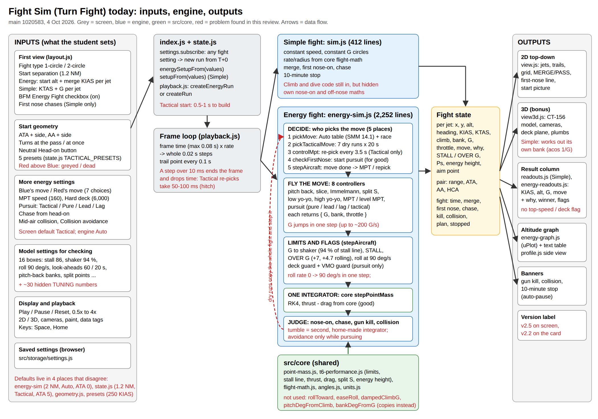
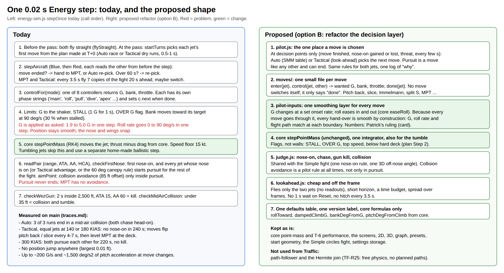

Status: Draft

# Fight Sim architecture: inputs, flow, outputs, and what to clean up

Written 4 Oct 2026 for Patrick, in the same shape as the Turn Sim map (`../turn-sim-review/architecture/architecture.md`). Read only: nothing in the repo was changed and no test suite was run. Code is main `1020583`. Paths are under `src/modules/turn-fight/` unless they start with `src/` or `tests/`. Guesses are marked.

**Terms, on first use.**
- *Settings object*: one flat list of named values the controls edit (`state.js` DEFAULTS), saved in the browser.
- *Setup*: the plain copy of the settings the engine takes when a fight starts (`energySetupFrom`, `state.js:250`).
- *State*: the one live object the engine updates every step and the screen reads.
- *Step*: one 0.02 s advance of the fight (`sim.js:23`).
- *Controller*: the code for one move (pitch back, MPT, pursuit ...). Each step it says what G, bank and throttle it wants.
- *Dry run*: a copy of the whole fight flown ahead in time, only to judge a move; the real fight is not touched.

## 1. Summary, in plain words

1. **The movement is sound; the decisions are tangled.** Unlike Traffic, every jet is moved by one integrator, core's point-mass step, with thrust and drag from core (`energy-sim.js:1898-1908`). No rails, no blends, no teleports: the largest position jump in 19 traced fights was 0.01 ft (`traces.md`).
2. **Five places decide what a jet does next** (section 4.4): the Auto table, the Tactical look-ahead, a re-pick inside the MPT controller (Tactical only), the nose-on check that starts pursuit, and the step's hand-over code. Pursuit, once started, never ends. Each of the 8 controllers is its own small state machine with phase names.
3. **That tangle shows in the flying.** Auto: 3 of 3 runs end in a mid-air collision. Tactical with equal jets at 140 or 180 KIAS: no nose-on in 240 s, the move flipping between pitch back and slice every 4 to 7 s. At 300 KIAS both jets chase each other for 220 s with no kill.
4. **Smooth track, snapping controls.** G is applied as asked, so a move change goes from 1.9 to 5.0 G in one 0.02 s step (up to about 200 G/s). Roll rate goes from 0 to 90°/s in one step. That is what would look like snaps in 3D.
5. **Tactical is expensive.** It flies 7 copies of the fight 20 s ahead, at the start (0.2 to 1 s on every Reset or setting change) and every 3.5 s (50 to 100 ms steps, which the frame loop drops, so the fight hitches; inference from `playback.js:111-115`).
6. **Settings and defaults are spread out.** 16 "model settings for checking" plus about 30 hidden tuning numbers; defaults in 4 places that disagree; 3 version labels.

## 2. The pictures

Overview: every input, the engine, the state and every output. Red marks a problem this review found.

One step today, and the proposed shape (option B in `review.md`):

(SVG sources: `architecture.svg`, `step-today-vs-proposed.svg`.)

## 3. Every file

Full table, imports and tests: `inventory.md`. In groups:

| Group | Files | Lines | State |
|---|---|---|---|
| Energy engine | `energy-sim.js` | 2,252 | The problem area: decisions and controllers in one file (section 4) |
| Simple engine | `sim.js`, `geometry.js` | 574 | Works. Climb and dive code still inside but unreachable (TF-R22 removes it) |
| Settings and run | `state.js`, `playback.js`, `index.js`, `trails.js` | 967 | Work. Defaults spread out (section 6) |
| Screen | `layout.js`, `readouts*.js`, `energy-readouts.js`, `t6-limit.js` | 960 | Work. Missing deck and top-speed flags (plan Step 2) |
| Pictures | `view.js`, `profile.js`, `energy-graph.js`, `view3d.js` | 1,682 | Display only. view3d works out its own bank in the Simple fight |
| Styles and readme | `turn-fight.css`, `README.md` | 713 | Readme stale |

## 4. Data flow

### 4.1 Settings to setup

- One settings object, `DEFAULTS` (`state.js:151`), saved in the browser (`src/storage/settings.js`). Every box has a value; nothing is read by nobody (inventory).
- Any **fight** setting change throws the fight back to T+0 (`index.js:305`). Display settings (2D/3D, tags, playback speed) do not.
- `energySetupFrom(values)` (`state.js:250`) builds the engine's setup; `checkedSetup` (`energy-sim.js:332`) fills anything missing from the engine's own `ENERGY_DEFAULT_SETUP` (`energy-sim.js:82`) and refuses bad numbers with a plain message.

### 4.2 Building a fight (`createEnergyFight`, `energy-sim.js:440`)

1. Place the jets from separation, ATA and AA, and slide the picture so the pass is at the centre (`placeStart`, `:388`).
2. Fly a copy to the pass to learn the turn directions (`atThePass`).
3. Pick each jet's first move and keep it as the plan (`chooseFirstMove`): Auto races an Immelmann against a pitch back by dry runs; Tactical flies a dry run for every feasible move (up to 7). Blue and Red are then re-raced against each other's pick once.

### 4.3 The state

Per jet: position (x, y, alt), heading, KIAS, KTAS, climb angle, bank (carried and from the horizon), G, throttle, move name, controller mode, reason text ("why"), STALL and OVER G with reasons, rolling, on the shaker, Ps, energy height, aim point, time and turn to reach the MPT, collided, tumble.
Per pair: range, ATA each way, AA, HCA.
Per fight: time, merged and when, first nose-on, chase, even fight, gun kill, collision, plan, stopped.

### 4.4 One step (`stepOnce`, `energy-sim.js:2106`)

1. Before the pass both jets fly straight; at the pass `startTurns` starts the planned moves.
2. For Blue, then Red (each reads the other from before the step), `stepAircraft` (`:1734`):
   - **Decide.** A finished move hands to the MPT, or Auto picks again; a move over 60 s is replaced. Inside the MPT, Tactical jets re-pick every 3.5 s by dry runs (`:1303-1320`).
   - **Fly the move.** `controlFor` (`:1711`) calls one of 8 controllers; it returns wanted G, bank and throttle.
   - **Limits and flags.** G to the shaker (94 % of the stall-line G); STALL (1 G for 1 s); OVER G above +7 or +4.7 rolling; bank moves toward its target at 90°/s (30 % when stalled). **G itself is not rate-limited.**
   - **Move.** core `stepPointMass` (RK4), speed floor 15 kt.
3. `readPair`, then `checkFirstNose` (`:2026`): first nose-on; any jet whose nose is on (or whose Tactical advantage is high, or, with different start heights, the 60° canopy rule) starts pursuit for the rest of the fight.
4. `readAims`, `checkWezGun` (2 s inside 2,500 ft, ATA 15°, AA 60° is a kill), `checkMidAirCollision` (under 35 ft starts the tumble).

### 4.5 What the screen reads

- 2D (`view.js`): positions, headings, trails, first nose, merge mark.
- 3D (`view3d.js`): Energy reads the engine's bank and climb; Simple works out its own bank from G and its own turn direction. Pitch shown is the flight path, with no angle of attack.
- Result column (`energy-readouts.js`, `readouts.js`), graph (`energy-graph.js`), banners (kill, collision, 10-minute stop).
- The screen writes nothing back into the engine.

## 5. Every user control

Defaults are the screen's (`state.js` DEFAULTS).

| Where | Control | Key | Default | Notes |
|---|---|---|---|---|
| First view | Fight type | `circles` | 2-circle | |
| | Start separation | `separationNm` | 1.2 NM | engine default 2 |
| | BFM Energy Fight | `energy` | on | Simple is one click away |
| | Start altitude, each jet | `blueAltFt`, `redAltFt` | 10,000 ft | Energy only |
| | Merge speed, each jet | `blueKias`, `redKias` | 220 KIAS | Energy only |
| | Speed, each jet | `blueKt`, `redKt` | 220 KTAS | Simple only |
| | G, each jet | `blueG`, `redG` | 5 | Simple only |
| | First nose chases | `chase` | off | Simple only |
| | Climb and dive, pitch boxes | `vertical`, `*PitchDeg` | off | **always hidden** (dead) |
| Start geometry | ATA and side | `startAtaDeg`, `startAtaSide` | 5° left | engine default 0 |
| | AA and side | `startAaDeg`, `startAaSide` | 180° | |
| | Red starts above Blue | `redAboveFt` | 0 | greyed in Energy (heights are per jet) |
| | When the turns start | `turnsAt` | at the pass | |
| | Neutral Head-on button, presets | | | 5 presets (state.js) |
| More energy settings | Blue's move, Red's move | `blueMove`, `redMove` | Tactical | engine default Auto |
| | MPT speed | `mptKias` | 160 KIAS | |
| | Hard deck | `hardDeckFt` | 6,000 ft MSL | |
| | Pursuit | `pursuit` | Pure | |
| | Chase from head-on | `chaseAfterHeadOn` | on | |
| | Mid-air collision, Collision avoidance | `collisionDetection`, `collisionAvoidance` | on, on | avoidance only works in pursuit |
| Model settings for checking (16) | stall speed, shaker %, stall time, mid throttle %, lead and lag time, roll rate, pitch-back banks at 160 and 220, Immelmann above, split S below, Immelmann off-nose, Immelmann lowest top speed, pick look-ahead, deck margin, Tactical look-ahead | | 86, 94 %, 1 s, 50 %, 1 s, 1 s, 90°/s, 60°, 30°, 220, 120, 120°, 120, 60 s, 1,000 ft, 20 s | TF-Q9: visible or hidden |
| Display | Data tags, side-view height scale, paint, 2D/3D, cameras, playback speed 0.5-4x | | | height scale greyed in Energy |
| Bar and keys | Play/Pause, Reset, Space, Home | | | |

Not on any screen: about 30 `TUNING` numbers (`energy-sim.js:160-186`), plus `blueForceG`, `redForceG` (test what-ifs).

## 6. Clean-up list (no change to the flying)

1. Delete the local `rollToward`; import core's (identical).
2. Use core `dampedClimbG` for the 4 copies of the flight-path lift formula, `bankDegFromG` in view3d and readouts (one cutoff), `wrapDeg180`, `isaDensityRatio`, `G_FTPS2`.
3. One nose-on rule and one 3D off-nose angle, shared by both fights.
4. One defaults table. Today: `energy-sim.js:82`, `state.js:151`, `geometry.js:26`, `sim.js:41`, presets.
5. One version label read from one place (card says v2.2, screen v2.5).
6. Remove Climb and dive and its two dead controls (already plan Step 2, TF-R22), with `profile.js` if nothing else uses it.
7. Stale comments: V6 golden test (`sim.js`, `energy-sim.js:7`, `readouts.js:107`, README), "4 G" where it is 5 (`sim.js:35`, `energy-sim.js` `pullCmdG`).
8. Tests: replace 1.68781 and 6076.12 with core units; review the tests that assert a limit is held (inventory, "Tests to look at").
9. About 16 engine exports used only by tests: keep the few the tests need, make the rest private.

## 7. What I did not read or check

- Nothing was looked at in a browser; the hitch and the 1 s Reset wait are inferred from Node timings and `playback.js`.
- `layout.js`, `view3d.js` and the CSS were read by the Sonnet reader, not line by line by me.
- E2E and unit tests were not run.
