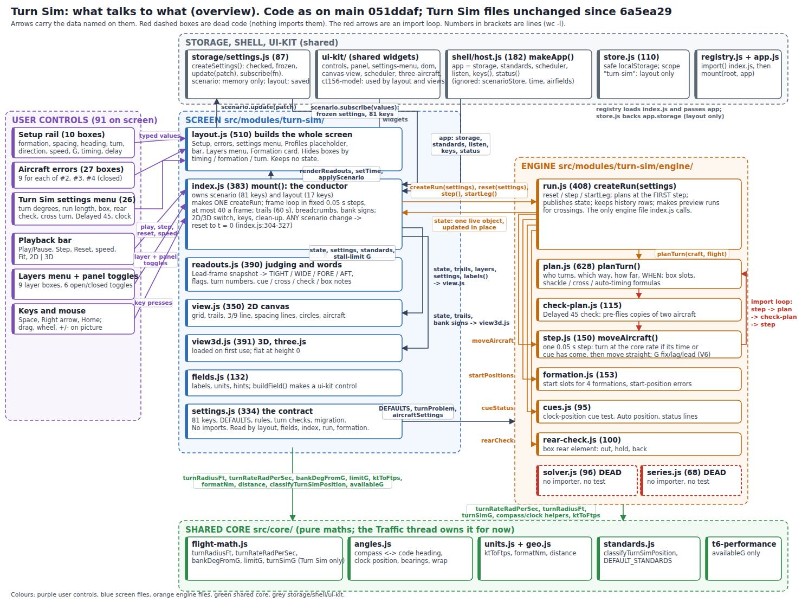
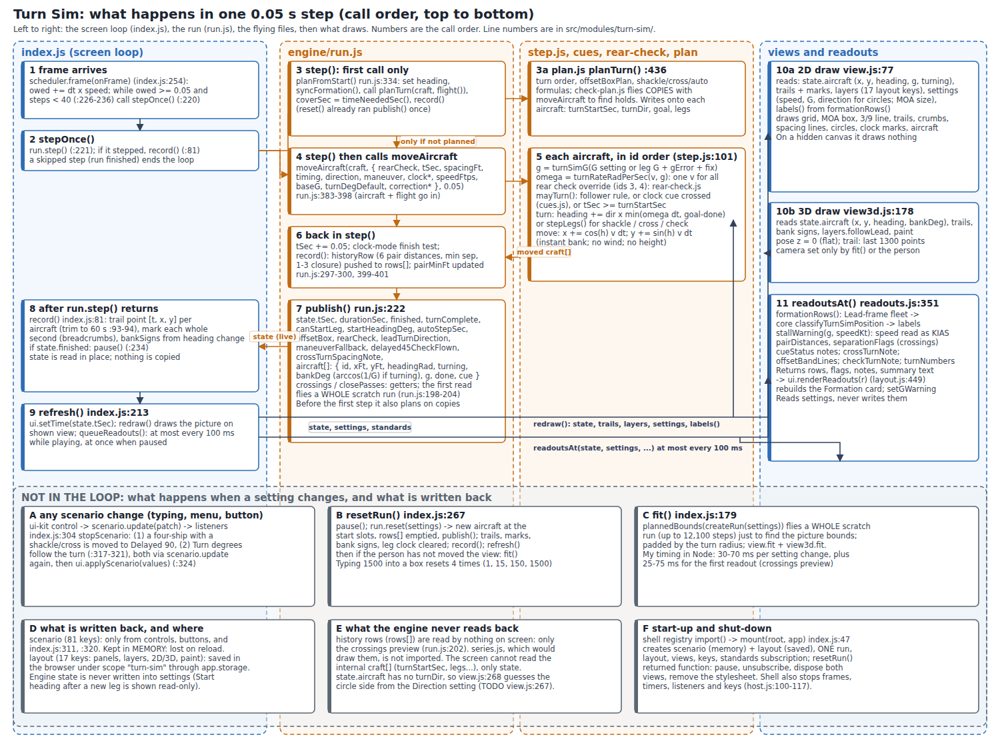

Status: Draft

# Turn Sim architecture: what is there, how it flows, what to clean up

Written 4 Oct 2026 for Patrick, as the facts for one decision: build a simple flyable line-abreast formation sim from the ground up (reusing bits), or refactor what is there. This file gives facts and a clean-up list, not the decision. Read only: nothing in the repo was changed, no test suite was run. Guesses are marked "guess".

**Code looked at.** Working tree `6a5ea29`. `origin/main` is now `051ddaf` (Traffic refactor PR 2); `git diff HEAD origin/main -- src/modules/turn-sim tests/unit/turn-sim tests/e2e/turn-sim.spec.js` is empty, so the Turn Sim code and tests are the same on both. Paths below are under `src/modules/turn-sim/` unless they start with `src/`, `tests/` or `docs/`. A citation `file:line` is a line in that file. Numbers I measured came from throw-away Node scripts kept in my scratchpad outside the repo (timings are this machine, one run each: a guess for a phone).

**Terms, on first use.**
- *Settings object*: one flat list of named values (81 for the scenario) that the controls edit and the engine reads.
- *State*: the one live object the engine updates after each step and the screen reads (`run.js:170`).
- *Step*: one 0.05 s advance of the simulation (`engine/step.js:16`).
- *Scratch run*: a whole second run made on a copy, only to learn something (the Fit bounds, the crossings preview).
- *Import loop*: files that each need another in the chain (here three, section 6, item 1).
- *Getter*: a field that computes its value when first read (`state.crossings`).

## 1. Summary, in plain words

1. **Today's Turn Sim plays a script.** At the first step it works out for every aircraft: when it starts turning, which way, and how far (`engine/run.js:334-349`, `engine/plan.js:436-628`). It then flies that script in fixed 0.05 s steps (`engine/step.js:101-150`). Speed is one number for everyone, the bank is instant, there is no height and no wind, and the aircraft do not react to each other except that a wingman can wait for a clock-position cue (`engine/step.js:50-53`).
2. **Any change to a setting throws the run back to t = 0** (`index.js:304-327`). A new leg can start only after the first has finished (`engine/run.js:228`, `:351-375`). So "press a manoeuvre button at any moment" does not exist in the code.
3. **Is today's code almost a flyable formation sim? For the screen, mostly yes. For the flying, no.**
   - The screen side is close: playback loop with fixed steps (`index.js:226-236`), 2D and 3D pictures, trails, grid, Lead 3/9 line, follow-Lead, Fit, spacing judging and the Formation card. About 40% of the 4,303 JavaScript lines.
   - The flying side is a one-shot script player. For Patrick's 08:53Z ruling (every aircraft flies a pre-planned, kinematically accurate path, worked out when a button is pressed from where each aircraft is) three things are missing: a press at any time, aircraft state that carries over between plans (no bank, roll rate or mid-turn state exists), and paths that include the roll in and out.
   - Closer to the ruling than the earlier review said: the code already plans from where the aircraft are (`startLeg`, `engine/run.js:351-375`), and `engine/check-plan.js:54-71, 81-115` already finds timings by flying copies of the aircraft through the step. Plan-then-fly is the right shape; the planner's output (start time, direction, goal angle, legs) is a script for a constant-rate turn, not a path with a roll-in (section 9).
   - Evidence in one line: the cheapest "button" I can see in the code is a small method that sets the manoeuvre and calls `startLeg()` (guess: about 20 lines). It would work only from straight and level after a turn has finished, would restart the clock at 0 each time, and would still have instant bank.
4. **Settings are mostly screen furniture.** 81 scenario keys plus 17 layout keys. 63 scenario keys have a box; 18 have none. Of the 81, 1 is dead (`showNm`), 2 are read only by a dead file (`solveFor`, `targetSpacingFt`), 23 more of the global keys act only in one turn, formation or timing, and 18 of the 27 error boxes act only when a switch above them is on (section 5).
5. **One import loop, two dead files, about 45 places that assume aircraft numbers 1 to 4, and a speed box that means two things.** Section 6.

## 2. The pictures

Overview: what talks to what. Red dashed boxes are dead code. The red arrows are the import loop.

One step: the order of calls for each 0.05 s step, and what is not in the loop.

(Hand-written SVG sources: `architecture.svg`, `architecture-step-loop.svg`.)

## 3. Every file

Lines are `wc -l`. "Used by" is who imports it inside the Turn Sim (plus the shell for `index.js`). "Tests": unit-test files that import it (21 unit files, 3,021 lines, in `tests/unit/turn-sim/`), or "e2e" for the Playwright spec `tests/e2e/turn-sim.spec.js` (905 lines, 45 `test(` calls by grep). Verdicts are for the planned-path, button-driven version and are mine; Patrick decides.

### Screen side (2,490 lines)

| File | Lines | What it does | Imports | Used by | Tests | Verdict |
|---|---|---|---|---|---|---|
| `index.js` | 383 | The conductor: builds both settings objects, the layout, one run and both pictures; fixed-step frame loop (`:226-236`); trails and breadcrumbs (`:81-97`); the reset-on-any-change rule (`:304-327`); Fit (`:179-195`); keys (`:351-355`); clean-up (`:370-380`) | settings, run, readouts, layout, view, view3d; shared dom, storage/settings, controls, `core/standards`, `core/t6-performance` | the shell (`src/shell/registry.js:28`) | e2e only | ADAPT. Keep the loop, trails, view switch, keys and clean-up (about 250 lines). Rewrite the reset rule and Fit (about 130 lines). |
| `layout.js` | 510 | Builds the whole screen (three columns, Setup rail, Aircraft errors, Settings menu, Profiles placeholder, playback bar, Layers menu, Formation card) and the layout defaults (`:27-46`) | fields, settings; shared dom, panel, settings-menu, controls, ct156-model | index.js, view.js (only for two colour constants, `view.js:11`) | e2e only | ADAPT. The frame, playback bar and Layers menu stay. The Setup form (about 250 lines) is replaced by manoeuvre buttons. |
| `fields.js` | 132 | Labels, units and hints for each setting, and `buildField` (one control from one setting) | settings | layout.js, readouts.js (for `clockLabel`, `readouts.js:12`) | `fields.test.js` | ADAPT. Keep the builder idea; the labels go with the settings they describe. |
| `settings.js` | 334 | The 81 keys, defaults (V6's and the rebuild's), allowed values, migration, `turnProblem`, `checkSettings` | none | index, layout, fields, engine/formation, engine/run | 20 of 21 unit files (for the defaults) | REPLACE with a short setup (formation, spacing, speed, heading). Keep the idea of one defaults file. |
| `readouts.js` | 390 | Judges each wingman against the standards in Lead's frame (`:62-148`), pair distances, separation flags, turn numbers, cue and plan notes, builds the Formation card's data (`readoutsAt`, `:351`) | fields; `core/standards`, flight-math, units, angles, geo | index.js, view.js (`pairDistances`) | `readouts.test.js` (27 tests), `fields.test.js` | ADAPT. Judging (about 300 lines) stays; plan notes (cue status, cross turn, offset band, check turn, about 90 lines) go with the old planner. |
| `view.js` | 350 | 2D picture on the shared canvas view: grid, MOA box, 3/9 line, trails, breadcrumbs, spacing lines, turn circles, clock marks, aircraft, labels; `plannedBounds` for Fit | layout (colours), readouts; shared canvas-view, `core/flight-math`, units | index.js | e2e only | REUSE with changes in section 7 (camera, tracks, circles from live state). |
| `view3d.js` | 391 | 3D picture (three.js loaded on first use): aircraft meshes, trails (1,300 points), ground grid, camera, `turnSign` | shared three-aircraft, ct156-model | index.js | `view3d.test.js` (7 tests) | REUSE. Pose has no pitch (`:79-88`); trails need changing (section 7). |
| `turn-sim.css` | 452 | Styles | none | index.js (`:25, 48`) | e2e | KEEP (guess: I did not read it in full). |

### Engine side (`engine/`, 1,813 lines)

| File | Lines | What it does | Imports | Used by | Tests | Verdict |
|---|---|---|---|---|---|---|
| `run.js` | 408 | One run: reset, plan at the first step, step, `startLeg`, history rows, publish `state`, crossings preview | settings, formation, plan, cues, step, rear-check; core angles, units, flight-math | index.js, solver.js | 17 unit files (through `createRun`) | REPLACE the lifecycle (plans at t = 0, ends at a duration). Keep `historyRow` and the pair list (about 25 lines). Keep the `createRun` shape if the old tests are to be used as sketches. |
| `plan.js` | 628 | The planner: who turns when, which way, how far; offset-box delay solving (`:108-321`); shackle hold, cross-turn second-stage G, auto step (`:349-416`); `planTurn` (`:436-628`) | formation, check-plan; core angles, units, flight-math | run.js, step.js | `plan`, `offset-box`, `run`, `shackle` tests | REPLACE as a planner (its output is a start time and angle, not a path). Keep the closed-form pieces (about 35 lines) as reference formulas and test oracles. |
| `step.js` | 150 | One 0.05 s step: turn if its start time or cue has come, then move straight (`:101-150`); the Correction model's G nudge and lag/lead bend (`:106-146`) | plan (`cueTargetForAircraft`), cues, rear-check; core flight-math, angles | run.js, check-plan.js, solver.js | via `createRun` only | REPLACE with a stepper that has bank, roll rate and per-aircraft speed. |
| `check-plan.js` | 115 | Delayed 45 with check turn: flies copies of two aircraft through `moveAircraft` to find each hold time | step; core angles, flight-math | plan.js | `delayed-45-check.test.js` (25 tests) | REPLACE (the knowledge, check 10 to 15 degrees then turn on the 5 or 7 o'clock cue, becomes manoeuvre content). Its method (fly a copy to plan) is the same idea Patrick chose. |
| `cues.js` | 95 | Clock-position cue test, Auto clock position, status lines | core angles | run.js, step.js | `cues.test.js` | ADAPT. Keep `clockCueCrossed` and `autoClockPosHours` (about 45 lines). |
| `formation.js` | 153 | Start slots for 4312, 2134, offset box, two-ship; start-position errors; `inferLineAbreastForm` | settings; core angles | plan.js, run.js | `formation.test.js` | ADAPT. Keep the slot geometry (about 60 lines); rename `rightVector`. |
| `rear-check.js` | 100 | Offset-box rear element check turn (out, hold, back) at a set time | core angles | run.js, step.js | `rear-check.test.js` | REPLACE (one generic "turn X degrees, hold, return" manoeuvre covers it). |
| `solver.js` | 96 | Tries 60 values by flying 60 whole runs, scores the spacing at the end | run, step | nobody | none | DELETE (dead). |
| `series.js` | 68 | Turns history rows into graph lines | none | nobody | none | DELETE or park (dead; no graph exists yet). |

**Not in the Turn Sim folder but only the Turn Sim uses it:** `core/flight-math.js:106` `turnSimG`, the V6 G-fix nudge, used only by `engine/step.js` (and `step.js:26-28` `flownG`). It sits in core.

### Tests, and what they would be for a rebuild

- 17 of 21 unit files go through `createRun`, so they keep working only if that function and `state.aircraft` keep their shape.
- None of `index.js`, `layout.js`, `view.js` has a unit test; they are covered by e2e only. `moveAircraft` has no direct test.
- The engine comments cite `tests/golden/turn-sim-*.test.js` (11 places); there is no `tests/golden/` folder in the repo (section 6, item 9).

## 4. Data flow

### 4.1 The settings objects

Two, both made by `createSettings` (`src/storage/settings.js`) and both frozen, type-checked and with allowed-value lists:

- **Scenario**: 81 keys (`settings.js:50-159`: V6's defaults at `:50-91`, the rebuild's at `:105-159`). Kept in memory only (`index.js:36-40, 51`): lost on reload. Wrapped by `createControls(scenario)` (`index.js:53`).
- **Layout**: 17 keys (`layout.js:27-46`): six panel open/closed flags, eight layer flags, the breadcrumb interval, the 2D/3D choice and the 3D paint. Saved in the browser under scope `turn-sim` through `app.storage` (`index.js:43-45, 52`).

The engine receives a plain copy: `createRun(scenario.get())` (`index.js:63`). It merges that over `DEFAULTS` (`engine/run.js:305`), applies the turn fallbacks (`:307-316`) and never checks ranges itself (`:113-115`); the number boxes do (`src/ui-kit/controls.js:56-84`). `checkSettings` (`settings.js:310`) is called only by tests.

### 4.2 The run

`createRun` (`engine/run.js:158-408`) returns `{ state, step, startLeg, reset, history }`. Inside it keeps `craft` (the private list of aircraft with all the plan fields), `rows` (history), `tSec`, `planned`, `planInfo`.

- `reset(settings)` (`:302-331`): new aircraft on their start slots, t = 0, nothing planned, then `publish()`.
- `step()` (`:377-404`): plans on the first call (`planFromStart`, `:334-349`); stops when finished; otherwise `moveAircraft`, `tSec += 0.05`, `record()`, `publish()`.
- `startLeg()` (`:351-375`): only when `state.canStartLeg`; t = 0, history emptied, start heading = Lead's heading, plan again from where the aircraft are.

### 4.3 The state, field by field (`engine/run.js:170, 222-256`)

Per run: `tSec`, `durationSec`, `finished`, `turnComplete`, `canStartLeg`, `autoStepSec`, `startHeadingDeg` (the compass heading the run began on; after `startLeg` it is Lead's heading), `rearCheck` (`{ enabled, phase, startSec, dir, angleDeg, holdSec }`), `offsetBox` (rear delays against the 10 to 15 s band), `leadTurnDirection`, `maneuverFallback`, `delayed45CheckFlown`, `crossTurnSpacingNote`, `crossings` and `closePasses` (getters), `aircraft[]`.

Per aircraft in `aircraft[]`: `id`, `xFt` (east), `yFt` (north), `headingRad` (math: 0 east, counter-clockwise), `turning`, `bankDeg` (arccos(1/G) while turning, else 0; `run.js:250`), `g`, `done`, `cue` (`{ mode, targetId, clockPos, cantSee }`).

What is not in it: speed, height, bank rate, turn direction (the 2D circles guess it from the Direction setting, `view.js:267-268`), the plan.

The array is rebuilt in place after every step (`state.aircraft.length = 0` then push, `run.js:241-254`); the screen reads it live and copies nothing (`index.js:79`).

### 4.4 What the views and readouts read

- **2D draw** (`view.js:77-103`): `state.aircraft` (x, y, heading, g, turning), `state.finished`, `state.tSec`; layers (the layout object); the scenario for `moaBoundaryNm`, `speedKt`, `baseG`, `direction`; trails and marks from `index.js`; labels from `formationRows`.
- **3D draw** (`view3d.js:182-249`): `state.aircraft` (x, y, heading, bankDeg), trails, the bank signs from `index.js:65, 86-88`, `followLead`, paint.
- **Readouts** (`readouts.js:351-390`, called at most every 100 ms while playing, `index.js:208-212`): `state.aircraft`, `state.crossings`, `state.closePasses`, `state.cue` lines, `offsetBox`, `delayed45CheckFlown`, `crossTurnSpacingNote`, `autoStepSec`, `maneuverFallback`, `leadTurnDirection`; and the scenario (speed, G, turn degrees, formation, maneuver, spacing). The turn numbers in the Formation card come from the settings, not from the aircraft (`readouts.js:237-242`).

### 4.5 History and series

`record()` (`engine/run.js:297-300`) pushes one row per step to `rows`: six pair distances, the smallest, and the Lead to #3 closure. Nothing on screen reads it. The only readers are the crossings preview (`:202`) and the tests. `series.js`, which would turn it into graph lines, is not imported by anything.

### 4.6 Write-back

The scenario is written only by the controls, the reset buttons, and two places in `index.js` (`:311`, `:320`: a four-ship with a shackle or cross turn is moved to Delayed 90; Turn degrees follow the turn picked). Engine state is never written into settings: the "This leg started on 090°" line is read-only (`layout.js:436-439`). The layout is written by its own controls and panel toggles.

### 4.7 Call order for one step

See the second picture. In words: frame arrives (`index.js:254`) -> owed time turns into steps, at most 40 a frame (`:226-236`) -> `stepOnce` (`:220`) -> `run.step()` -> first call plans (`planTurn` on the live craft) -> `moveAircraft` for each aircraft in id order (G, turn rate, rear-check override, "may it turn", turn or straight, move) -> `tSec += 0.05`, history row -> `publish()` -> back in `index.js`: `record()` trail and breadcrumb points (`:81-97`) -> `refresh()` (`:213-217`): time label, redraw, readouts.

Per-aircraft maths inside the step (`engine/step.js:107-148`): G = `turnSimG(...)`; turn rate = `turnRateRadPerSec(v, g)`; heading += direction x min(rate x 0.05, goal - done); then `x += cos(heading) v 0.05`, `y += sin(heading) v 0.05` using the heading at the end of the turn (V6's Euler step, kept on purpose).

### 4.8 Cost of a reset (my timing in Node, this machine, guess for a phone)

Each setting change calls `resetRun()` (`index.js:325`): `createRun` 0.7 to 22 ms, then `fit()` flies a whole scratch run (30 to 70 ms; up to 12,100 steps, `view.js:45`), then the first readout reads `state.crossings`, which flies another whole scratch run (25 to 73 ms, `engine/run.js:198-204`). Typing 1500 into a box resets four times (1, 15, 150, 1500).

## 5. Every user control

Setting keys are flat strings (`aircraft2.gError` and so on). "Real effect" says what I found by flying the engine with and without the change in Node (settings only; the check that a key changes the flight). "Counted" is in the tally at the end.

### 5.1 Setup rail: 10 boxes (`layout.js:86-121, 204-224`)

| Box | Key | Default | Read by | Real effect |
|---|---|---|---|---|
| Formation | `formation` | `weighted` (4312) | `engine/formation.js:57-90`, `plan.js`, `run.js:318`, `readouts.js:78,203` | Yes |
| Spacing | `spacingFt` | 6,000 ft | `formation.js:57`, `plan.js:394-407`, `readouts.js:96-128`, `run.js:270` | Yes |
| Start heading | `startHeadingDeg` | 0 (north) | `formation.js:59,118`, `run.js:127,170,319` | Yes |
| Turn | `maneuver` | `delayed90away` | `plan.js:436`, `run.js:262,389`, `readouts.js` | Yes |
| Direction | `direction` | right | `plan.js`, `step.js:53`, `view.js:268` | Yes, except shackle and cross (greyed, `layout.js:326-337`) |
| Speed (labelled KTAS) | `speedKt` | 220 | `step.js:102` (every aircraft's speed), `plan.js`, `readouts.js:150-152` (read as indicated), `view.js:261` | Yes |
| G | `baseG` | 3.0 | `step.js:113-114`, `plan.js`, `readouts.js` | Yes |
| Timing | `timing` | `time` | `plan.js:431`, `step.js:50`, `layout.js` | Yes (TS-R7 wants the default to be `clock`) |
| Base delay | `baseDelaySec` | 16 s | `plan.js:424,447-455` | Only with Timing = time (hidden otherwise) |
| Clock position | `clockCuePos` | `auto` | `cues.js:33-47`, `step.js:53` | Only with Timing = clock (hidden otherwise) |

### 5.2 Turn Sim settings menu: 26 boxes (`layout.js:157-196`)

| Group | Key (default) | Real effect |
|---|---|---|
| Turn and run | `turnDeg` (90, follows the turn picked), `durationSec` (75), `durationCoversTurn` (true) | Yes |
| | `moaBoundaryNm` (30) | Picture only: the purple box (`view.js:93`) |
| Line abreast | `twoSide` (left) | 4312 and 2134 only (`formation.js:78`) |
| Offset box (10) | `boxAftFt` (7,000), `boxStaggerFt` (0), `offsetBox4Timing` (`boxSlot`), `rearDelaySec` (12.5), `rearCheckOn` (false), `rearCheckStartSec` (40), `rearCheckDir` (left), `rearCheckAngleDeg` (20), `rearCheckHoldSec` (5), `rearCheckAfterTurns` (true) | Offset box only. `rearDelaySec` acts only with `rearDelay` timing or in the hook; `rearCheckAfterTurns` only when the check starts early. |
| Cross turn (3) | `crossTurnFirstG` (2.0), `crossTurnSwitchDeg` (90), `crossTurnSolveSpacing` (true) | Cross turn only |
| Delayed 45 (3) | `delayed45Check` (`auto`), `checkTurnDeg` (12.5), `checkSolveSpacing` (false) | Delayed 45 only; not with the clock cue |
| Clock cue (3) | `clockCueAircraft` (1), `clockCueSequence` (`outsideIn`), `clockCueTolDeg` (4) | Clock timing only; `clockCueAircraft` matters only with sequence `manual` |
| Correction model (2) | `correction` (`none`), `correctionStrength` (0.5) | Strength acts only when the model is not `none` |

### 5.3 Aircraft errors panel: 27 boxes, 9 for each of #2, #3, #4 (`layout.js:128-147`, `fields.js:75-89`)

Keys `aircraft<id>.` plus: `delayErrSec` (0), `gError` (0), `positionErrorOn` (false), `lateralDir` (`none`), `lateralFt` (0), `foreAftDir` (`none`), `foreAftFt` (0), `clockTarget` (`global`), `clockPos` (`global`). Read by `run.js:78-82`, `plan.js:422`, `step.js:25`, `formation.js:89-127`, `cues.js:45`. All act on the flight; the position boxes show only when "Put it out of position" is on, the two clock boxes only with Timing = clock, and `clockTarget` only with sequence `manual`.

### 5.4 Keys with no box on the screen: 18 of the 81

- `showNm` (`settings.js:57`): read by nothing. Dead.
- `solveFor`, `targetSpacingFt` (`:87-88`): read only by the dead `solver.js`.
- `rearDelayMinSec`, `rearDelayMaxSec` (10 and 15, `:158-159`): read only to flag a delay outside the band (`run.js:132, 233`).
- `aircraft1.*`, 10 keys: they do change Lead's flight if set (`run.js:71-103` reads them for every id) but nothing sets them.
- `aircraft2.turnLogic`, `aircraft3.turnLogic`, `aircraft4.turnLogic` (`aircraft*.turnLogic` has no field in `fields.js:75-89`): changes the flight if set; nothing sets it.

### 5.5 Playback bar, Layers menu, panels, keys, mouse

| Control | Where | What it does |
|---|---|---|
| Play / Pause | `layout.js:224`, `index.js:248-265` | Starts or stops the frame loop; Play after a finished turn starts a new leg first (`:239-246`) |
| Step | `layout.js:225`, `index.js:281-286` | One 0.05 s step |
| Reset | `layout.js:226`, `index.js:267-279` | Back to t = 0 |
| Speed 0.25x to 4x | `layout.js:227-232`, `index.js:291` | How many steps run per frame, never their size |
| Fit | `layout.js:233`, `index.js:294` | Section 7 |
| 2D / 3D | `layout.js` `lc.viewSwitch()`, key `view` | Switches picture; 3D loads three.js on first use |
| Layers (9 boxes) | `layout.js:259-269` | `lead39` (on), `turnCircles` (on), `errorLabels` (on), `spacingLines` (on), `followLead` (off), `clockMarks` (off), `breadcrumbs` (off), `crumbSec` (10), `distNm` (off); 2D only except `followLead` |
| Reset layout | `layout.js:269` | Back to the layout defaults |
| Panel toggles (6) | Setup, Formation, Aircraft errors, Turn Sim settings, Profiles, More detail | Open or closed, remembered |
| Paint | settings menu, `layout.js:196` | 3D paint (harvard or ship) |
| Correction on/off checkbox | `layout.js:190-194` | Sets `correction` to `gfix` or `none` |
| Reset to defaults (3) | Setup, Aircraft errors, Settings menu | Puts those settings back |
| Keys | `index.js:351-355` | Space plays or pauses, Right arrow steps, Home resets (not while typing) |
| Mouse on the picture | `src/ui-kit/canvas-view.js:168-212` | Drag pans, wheel or + / - zooms, arrows pan |

**Tally of boxes and buttons on screen: 91** = 10 (setup) + 27 (errors) + 26 (menu) + 1 (correction checkbox) + 1 (paint) + 3 (reset to defaults) + 6 (playback bar items: play, step, reset, speed, 2D/3D, Fit) + 1 (Layers button) + 9 (layer boxes) + 1 (Reset layout) + 6 (panel toggles). 63 scenario keys have a box (10 + 26 + 27).

## 6. Clean-up list

Each with file:line and size. Sizes are line counts of the thing, from my reading. "Guess" where I did not trace it.

1. **Import loop.** `engine/step.js:12` imports `plan.js`, `plan.js:14` imports `check-plan.js`, and `check-plan.js:12` imports `step.js`. It works because each file only uses the others inside functions, which is fragile (a new top-level use breaks it). The only thing `step.js` needs from `plan.js` is `cueTargetForAircraft` (`plan.js:46-51`, 6 lines), which belongs next to the cue test in `cues.js`. Size: about 6 lines to move.
2. **Two dead files.** `engine/solver.js` (96 lines) and `engine/series.js` (68): no importer and no test. About 164 lines.
3. **Dead and unreached settings.** `showNm` (`settings.js:57, 192`), `solveFor` and `targetSpacingFt` (`:87-88` and their rules, `:230-231`), 18 keys with no box (section 5.4). `checkSettings` and `settingIsValid` (`settings.js:265-330`, about 65 lines) are used only by tests; the app does not call them. `engine/rear-check.js:12` `REAR_CHECK_PHASE` and `engine/plan.js:25` `sideOfLead` (8 lines) are exported and called by nothing anywhere; several other exports are used only inside their own file (for example `formation.js:26` `isTwoShip`).
4. **Formulas that exist in `src/core` and are written again.**
   - `view.js:13` `FT_PER_NM = 6076.11549`, while `view.js:9` already imports from `core/units.js`, where `FT_PER_NM` is 6076.12 (`units.js:5`). Two values for one constant.
   - `view3d.js:41` `wrapRad` and `:47-58` yaw wrapping: core has `wrapPi` (`angles.js:39`) and `wrapDeg180` (`:28`).
   - `readouts.js:196` and `:228`: wrap and heading difference by hand; core has `wrapDeg180` and `angleDiffRad` (`angles.js:28, 46`).
   - `engine/run.js:361` and `settings.js:248`: wrap to 0 to 360 by hand; core has `wrapDeg360` (`angles.js:125`).
   - `engine/check-plan.js:61`, `:84`: `goalRad * 180 / Math.PI`; core has `radToDeg`.
   - `layout.js:54-55` `SHIP_COLORS` and `OUTLINED_SHIPS` are the same values as `src/modules/debrief/state.js:14-16`. A shared home (ui-kit) would be the place; not for the Turn Sim alone to decide.
   - `core/flight-math.js:106` `turnSimG`: one Turn Sim function that lives in core.
   Each is small (1 to 3 lines) except the last.
5. **V6 shortcuts that are not physics.** Lag and lead bend the direction of travel by 4 degrees x strength with no bank (`step.js:142-146`); the G fix nudges G by distance to Lead against `spacing x |id - 1|`, which is wrong for 4312 and the box (`core/flight-math.js:~113-117`, `step.js:106-122`); instant bank (`run.js:250`, `step.js:124-139`); the V6 `late` and `early` offset-box timings (`settings.js:60`, `plan.js:~311`); fallbacks `|| 90`, `|| 6000`, `|| 8000` (`plan.js:~410-412, ~479`); an absent aircraft parked 999,999 ft away (`formation.js:23`). The Correction model block is about 45 lines across `step.js`, `flight-math.js`, `layout.js:190-194, 378-379`, `fields.js:72-73`.
6. **Aircraft numbers 1 to 4 written into the logic.** About 45 sites: `plan.js:324` partner table, `step.js:104` rear = ids 3, 4, `rear-check.js:53, 97`, `run.js:29` pair list, `formation.js:32, 79, 82, 95`, `cues.js:94`, `plan.js:252-255, 476-481, 515-519, 532, 576, 607-608`, `readouts.js:78, 123, 200-204, 320`, `layout.js:128`, `settings.js:25, 220`, `view.js:19`. A two-ship, a different four-ship shape or a six-ship would touch all of them. (This is the main reason a new engine should hold "who flies off whom" as data.)
7. **Names that mislead.**
   - `rightVector` (`formation.js:36`) points to the aircraft's left on this north-up map. The file says so at `:12-15`; code that calls it must remember.
   - The speed box is labelled KTAS (`fields.js:41`, `readouts.js:386`) and flown as one speed for everyone (`step.js:102`), yet the stall warning reads it as indicated airspeed (`readouts.js:147-152`). One number, two meanings.
   - Two different functions are both called `cueStatus`: per aircraft in `engine/cues.js:89`, and the card lines in `readouts.js:268`.
   - `layout` means both the file `layout.js` (builds the screen) and the saved-settings object (`index.js:52`).
   - `startHeadingDeg` means the setting before the first leg and Lead's heading after a new leg (`run.js:227, 361`).
   - `flownG` (`step.js:26`) is the G with errors but no correction; `weighted` means 4312 (`settings.js:62`).
   - `bankDeg` in the state is arccos(1/G) only while `turning`, else 0, so it is not a bank the aircraft has but a label.
8. **Arrays that only grow.** `rows` in `engine/run.js:165, 298`: one row per step, about 20 a simulated second, never trimmed (the code says so, `:154-156`); nothing on screen reads it. `marks` (breadcrumb points) in `index.js:67, 95`: one point per whole second per aircraft, cleared only on reset or a new leg (`:243, 271`). The trail is trimmed to 60 s (`:92-94`). In an endless button-driven flight both keep growing (about 72,000 rows an hour; guess on memory).
9. **Comments that point to files that do not exist.** `tests/golden/turn-sim-*.test.js` is cited 11 times (`engine/run.js:10`, `step.js:4`, `formation.js:3`, `series.js:10`, `solver.js:3`, `tests/unit/turn-sim/run.test.js:13`, `offset-box.test.js:12`, `rear-check.test.js:13`, plus three more in `src/modules/traffic/sim.js`, `src/modules/traffic/readouts.js` and `src/core/t6a-turn-charts.js`; I did not check what they refer to); there is no `tests/golden/`. `layout.js:443` points to a `TODO(D128)` in `index.js` that is not there. About 90 comments cite V6 line numbers.
10. **Whole-run scratch flights at every setting change.** Fit (`index.js:182`, `view.js:45-58`, up to 12,100 steps); the crossings preview (`engine/run.js:198-204`); a planning pass on copies at every reset (`run.js:230-231`); `check-plan.js:54-71, 81-115` and the box delay searches (`plan.js:108-224`; the earlier review counts up to 121 trial delays, which I did not check) fly more copies. These belong to a finite run known in advance; with an endless flight there is nothing to scratch-fly.
11. **Typing resets the run once per keystroke that makes a valid number** (`index.js:304-327`): four times for "1500" (section 4.8). With a button-driven sim most of these settings are no longer inputs.
12. **Screen files depend on each other for constants.** `view.js:10-11` imports `readouts.js` and `layout.js`; `readouts.js:12` imports `fields.js` (screen labels) for `clockLabel`; the engine imports `settings.js` (`formation.js:17`, `run.js:20`). None is a loop; all make a file hard to move on its own.
13. **Two import lines from one module** in `engine/run.js:19` and `:25` (both `core/flight-math.js`). Trivial.

## 7. Camera, trails and ground lines (Patrick's extra item)

Patrick's first version: button-driven; the camera keeps following the formation; lines stay drawn on the ground. My working reading (as in the folder README): each aircraft's ground track stays drawn for the whole flight, over a ground grid.

### 7.1 What today's code already has

| Thing | 2D | 3D | Default |
|---|---|---|---|
| **Follow Lead** layer | `view.js:86-87`: at every draw, if Lead has moved, the view centre is set to Lead; zoom unchanged | `view3d.js:197-199`: the camera focus is Lead; the ground grid follows in whole 5,000 ft steps (`:241-246`) | off (`layout.js:36`), saved in the browser |
| **Fit** button | `index.js:179-195` flies a scratch run of the whole planned turn (`view.js:45-58`), pads by the turn radius plus 500 ft, then `view.fit` (`view.js:115-119`) | `view3d.fit` (`:363-367`, `fitCamera` `:96-111`): centre and zoom for the box, yaw behind Lead's heading at that moment only | pressed by the person, and automatically after a setting change unless the person moved the view (`index.js:326`) |
| **Trails** | `view.js:193-209`: one 2 px line per aircraft, alpha 0.55; points from `index.js:81-97` every step | `view3d.js:168-178, 219-231`: 1,300-point buffer per aircraft (`:35, 172`), the last 1,300 only | always on |
| **60 s trim** | `TRAIL_SEC = 60` (`index.js:34`); points older than that are removed at each step (`:92-94`) | the 1,300-point cap is the same 60 s (1,200 points) with room | |
| **Breadcrumbs** | `view.js:212-225`: a dot and "Ns" every `crumbSec` seconds; points from `index.js:95` | none (2D only, `layout.js:49`) | off; every 10 s |
| **Grid** | `view.js:137-156`: lines one NM apart, widening by factors of 5 when closer than 14 px; fixed to the ground (multiples of the step), no labels, no switch | `view3d.js:144-147`: 40 x 40 cells of 5,000 ft, 1,500 ft below the aircraft | always on |
| **3/9 line** | `view.js:174-191`: a dashed line across Lead's heading through Lead, long enough for the screen, "Lead 3/9" label; drawn now, not stored | none (2D only) | on |
| Lines kept across legs | `index.js:68, 241`: the trail keeps its order across legs; breadcrumbs restart each leg (`:243`) | | |

### 7.2 What must change to follow the whole formation continuously and keep full ground tracks

1. **Follow the formation, not Lead.** Both `view.js:87` and `view3d.js:199` look only at aircraft 1. They would need the formation's centre (mean of the positions, or the middle of the bounding box; smoothing is a choice, not in the code).
2. **Keep everyone on screen as the formation spreads.** Follow keeps the zoom fixed, so after a Delayed 90 (spacing grows from 6,000 to about 12,000 ft and the line abreast stretches) aircraft can leave the picture. The code has no auto-zoom while playing. Fit is a one-off.
3. **Panning is fought while following.** The centre is reset inside `draw()` whenever Lead's position differs from the centre (`view.js:87`), so a drag is undone at the next redraw (my reading of the code; not tried in a browser). If the person should be able to look around while it follows, this needs a rule (guess: follow resumes on a button).
4. **Fit must stop flying a planned run.** `plannedBounds` (`view.js:45-58`) and `index.js:182` assume a finite, known run. With planned paths computed at each press the extent of those paths is already known data (free), and the current aircraft positions are the other input. The padding by turn radius (`index.js:189`) can stay.
5. **Full ground tracks.**
   - Remove the 60 s trim (`index.js:92-94`). Left as it is, an hour of flight is 80 points a second (4 aircraft x 20 steps), about 288,000 points, redrawn in full on every frame (`view.js:196-207`; each point goes through `worldToScreen`). Storing a thinned track (one point every 0.5 s, or every 20 ft or so, or when the heading changes) and drawing only what is on screen keeps it cheap (a recommendation).
   - 3D: the buffer is a fixed `TRAIL_POINTS = 1300` (`view3d.js:35, 172`) and only the last 1,300 points are copied (`:224-225`). It needs a larger or growing buffer, or segments.
   - One continuous clock: trails use `elapsed = legStart + tSec` (`index.js:83`) but breadcrumbs use `s.tSec` (`:95`), which restarts each leg, so their labels restart. In an endless flight there are no legs; use one clock.
   - Breadcrumbs are 2D only. 3D has no marks.
6. **"Lines stay drawn on the ground."** Today only the tracks and breadcrumbs persist. The 3/9 line is drawn through Lead for the instant and then gone. If Patrick means more than the tracks (for example a line abreast reference left on the ground at the start or end of a manoeuvre) nothing in the code stores such a line; that would be new.
7. **Defaults.** Follow is off and the setting is saved per browser (`layout.js:36`, `index.js:43-45`), so changing the default in code does not change a returning user's screen. (Guess: this matters for Patrick's own browser.)
8. **3D camera direction.** Yaw is set to "behind Lead" only when Fit is pressed (`view3d.js:98-109`); with follow on, the camera slides but does not turn with the formation. A chase camera would need the yaw to follow the heading (a choice).
9. **The grid** is already ground-fixed in both views, which is what follow needs. It has no distance labels (2D) and no switch.

## 8. Can Turn Sim reuse Traffic's path follower and the new core functions?

Read from `origin/main` (`051ddaf`) with `git show`, no checkout. Traffic owns these files; this is a recommendation only.

### 8.1 What each piece is

| Piece | Where on `origin/main` | What it does |
|---|---|---|
| `followRoute(a, route, env, dt, options)` | `src/modules/traffic/path-follower.js:50-105` | Moves an aircraft along a built path by distance: ground speed from the wind triangle (`:56-61`), position from the path (`:63-65`), 3 s smoothing of any join gap (`joinOffset`, `:66-73`), heading = track + crab (`:81-90`), bank from the heading rate (`:92-95`), G from bank (`:98`), pitch from climb (`:100-103`) |
| `trackAt(route, dist)` | `path-follower.js:37-43` | The track read across +/-150 ft (`TRACK_WINDOW_FT`, `:27`) so a rounded turn drawn as short straight pieces never steps |
| `joinOffset` | `path-follower.js:67-73`; set at `sim.js:257, 282`, `tick-aircraft.js:312` | Closes a small gap to a new path over about 3 s (`JOIN_SEC`, `:34`, an estimate) |
| `bankDegFromTurnRate(tasFtps, rateRadPerSec)` | `src/core/flight-math.js:78` | Standard coordinated-turn bank for a heading rate, signed; the inverse of `turnRateFromBankRadPerSec` (`:64`) |
| `easeRoll(bank, rate, target, dt, {maxRateDps, maxAccelDps2})` | `src/core/flight-math.js:221` | One step of a smooth roll toward a target bank, limited in rate and in rate change |
| `pitchDegFromClimb(climbFtps, tasFtps, kias, g)` | `src/core/t6-performance.js:155` | Flight path angle plus angle of attack, `2.8 x G x (180 / KIAS)^2` degrees (`T6A_PITCH`, `:149`); the docstring calls it an estimate until checked on screen |
| `ROLL` | `src/modules/traffic/circuit.js:36` | 45 deg/s, building at 90 deg/s^2; estimates, "no manual gives a normal roll rate" |
| `makePilot` | `circuit.js:154-197` (not exported) | A simulated pilot: easeRoll, heading from bank, position with wind, climb and speed; records a path point every 0.4 s (`:72`) |

### 8.2 The judgement

- **The three core functions: use as they are, no move needed.** They are already in `src/core`, pure, with no Traffic imports (`flight-math.js`, `t6-performance.js` on `origin/main`). Turn Sim can import them directly. What it must supply:
  - `easeRoll`: its own limits. Patrick's ruling (4 Oct 08:54Z) is 90 deg/s, "0 to 70 degrees in about 0.8 s". The function also takes a roll-rate-change limit, which the ruling does not give. My arithmetic, with the real function, for a 3 G (70.5 degree) bank: Traffic's 45 and 90 gives 1.95 s to reach the bank; 90 deg/s with Traffic's 90 deg/s^2 gives 1.65 s (not 0.8); 90 with 360 gives 1.00 s; 90 with 720 gives 0.85 s; 90 with an unlimited change rate gives 0.80 s. By the time the bank is reached, about 7 degrees of heading are lost to a 0.8 s roll-in compared with an instant bank at 220 KTAS (15 to 18 degrees at the 45 or 90 deg/s with 90 deg/s^2 limits). So the roll-rate-change number needs a ruling, or one set to match the 0.8 s (marked as an estimate).
  - `pitchDegFromClimb` needs KIAS; Turn Sim today has KTAS and no height (TS-R6 asks for indicated speed). In a flat sim the climb term is 0, so pitch is the angle-of-attack term only, about 5.6 degrees at 3 G and 220 KIAS by that formula (my arithmetic). The 3D view has no pitch at all today (`view3d.js:79-88`); Traffic's draws one.
  - `bankDegFromTurnRate`: needed only if a path is specified as a heading curve and the bank is read back from it. If the planner integrates from a bank (as `circuit.js:176-181` does), it is not needed.
- **`followRoute`, `trackAt`, `joinOffset`: do not fit as they are, and cannot be imported.** Reasons, with lines:
  1. It imports Traffic's own files, `./route.js` and `./circuit.js` (`path-follower.js:19-20`), and AGENTS.md says modules never import each other.
  2. It reads a path only through `posOnRoute` (`:38-39, 57, 63`), which goes through `routePath` and `buildPath` (`route.js:275-290`). `buildPath` has special cases for the pattern and PFL routes, and otherwise rounds the corners of a waypoint route (`buildRoundedPoints`). What that does to an already dense planned path I did not trace (unsure).
  3. Speeds are KIAS and height per point, turned into true airspeed (`:58, 81`) and ground speed through the wind triangle, headings and tracks in compass degrees. Turn Sim today is flat, no wind, math radians; each is a decision, not a fit.
  4. The bank is derived by differentiating a track read over a +/-150 ft window and then eased a second time (`:92-97`). At 220 KTAS (371 ft/s) the window is about 0.8 s wide, the same size as the 0.8 s roll-in Patrick set, so the displayed bank would lag the real one (my reading: the planner already knows its bank, so deriving it back adds lag). Traffic's pilot builds the roll into the path itself (`circuit.js:177`).
  5. The roll limits are the Traffic constant `ROLL` (`:95`), not a parameter.
  6. `joinOffset` smoothing is only needed when a new path starts a little off the aircraft. If Turn Sim plans from each aircraft's exact state (position, heading, bank, roll rate) at the press, there is no gap to close.
- **Should anything move into shared core? Only if Patrick wants one follower for both modules, and not now.** What would move, and why: (a) split `followRoute` into a generic follower that takes a `pathAt(distFt)` function and a roll-limit parameter, and a thin Traffic wrapper that passes `posOnRoute` and `ROLL`; (b) put one named roll-limit pair in core, with each module passing its own numbers. The generic part is about 60 of the 105 lines (guess). It needs Traffic's agreement and its tests, and only after PR 2 settles. For Turn Sim alone I would not: if the planner records heading, bank, G and pitch at each 0.05 s step (an aircraft flying 60 s of manoeuvre is 1,200 samples; four aircraft, 4,800), the "follower" is a read by time index, a few lines (guess), and all the flight math it needs is the core functions above. That keeps one copy of each formula without touching Traffic's files.
- **What Turn Sim cannot get from Traffic today:** the planner. `makePilot` is private to `circuit.js` and wired to the airfield and wind; the pilot laws (`BANK_PER_DEG`, `HOLD_RADIUS_FT`, `LEVEL_OFF_SEC`, `circuit.js:64-70`) are Traffic's estimates. A formation planner has to be written; the idea (simulate a pilot, record the path) transfers, the code does not.

## 9. The earlier review (`/mnt/project-files/reset/1-requirements/agents/turn-sim-architecture-review.md`)

**Checked and right** (I re-read the code for each):
- The plan is made once at the first step, and flown open loop (`run.js:377-378, 334-349`); reset on any change (`index.js:304-327`); `startLeg` after the turn only (`run.js:351-375`).
- 81 keys = 41 plus 10 per aircraft for four; 27 error boxes, and the 10th aircraft key (`turnLogic`) has no box.
- KTAS used as the speed and read as indicated by the warning (`fields.js:41`, `step.js:102`, `readouts.js:147`).
- Instant bank, flat, one speed, history never trimmed, `rightVector` is the left, ids hard-wired, no `tests/golden/` folder.
- Line counts: 4,303 JavaScript lines, 1,813 in the engine, 2,490 on the screen side, 452 CSS; 21 unit files and 3,021 lines.

**Wrong, stale or incomplete:**
1. **The main framing is superseded.** The earlier review treats "the whole turn is pre-planned" as the conflict and recommends live wingman controllers (its option b, question A). Patrick's 4 Oct 08:53Z ruling says planned paths computed at the press. So plan-then-fly is now the intended shape, and `planFromStart`/`startLeg`/`planTurn` and `check-plan.js` (fly copies to plan) are nearer to it than the review allows. What still conflicts is narrower: the plan happens at t = 0 only (or after a finished leg); the plan is a script of start times and angles, not a path with roll dynamics; no bank or roll-rate state to carry into a new plan.
2. `plan.js` verdict "REPLACE as a planner" stands for its output type, but its closed forms and the "fly a copy to plan" method are now useful, not just test oracles.
3. **Crossings preview timing is not "before the first step".** The getter runs the scratch run on the first read of `state.crossings`, which is the first readout after each reset (`engine/run.js:198-204`, `readouts.js:214`, `index.js:216, 278`), so every setting change pays it (25 to 73 ms in Node). After a new leg it does not run (`run.js:356`).
4. **Missed: `marks` also grows without limit** (`index.js:67, 95`); the review notes only the history rows.
5. **Missed: panning is overridden while Follow Lead is on** (`view.js:87`), and Follow keeps a fixed zoom; the review rates `view.js` "fits with small changes" and does not cover the camera (section 7).
6. **Missed: `checkSettings` is only used by tests**; the app's checks are the controls' own and `createSettings`' allowed lists (`index.js:51`). Also `scenarioStore` in `src/shell/host.js:75` is unused by the Turn Sim.
7. **Line citations in its "right vector" row are garbled** (the Lines column says 257-283, the Source column is right: `formation.js:12-15, 35-38`; the function is at `formation.js:36`). Its "`state.aircraft.turnDir` is missing" (`view.js:267`) is right.
8. The review did not test which settings change the flight; I flew each key (section 5). 63 keys have a box and 18 do not; of the 41 non-aircraft keys, 1 is dead and 2 feed only a dead file.
9. The "about 40% kept" tally: I did not redo it from scratch. The kept and adapted parts in my section 3 verdicts add up to about 1,770 of 4,303 lines (about 41%), so I agree with the figure; it is a guess in both reviews.

## 10. What I did not read, or am unsure of

- `turn-sim.css` (452 lines), `src/ui-kit/*` beyond `controls.js`, `canvas-view.js` and the parts named, `src/shell/*` beyond `host.js:28-120`, `src/core/standards.js` beyond `classifyTurnSimPosition` (`:256-316`).
- I ran no tests (instructed). The counts of tests are from `grep`, not from a run. I did not open the app in a browser; the claims about panning, layout defaults and 3D camera are from reading the code.
- Traffic: `route.js` `buildRoundedPoints` and `generate*Track` (not traced), `circuit.js` laws beyond `makePilot` and the constants, `sim.js` and `tick-aircraft.js` beyond the `joinOffset` lines.
- Unsure: how `routePath` treats a dense path of points (section 8.2, reason 2); whether dense planned samples need `TRACK_WINDOW_FT`-style smoothing at all (guess: not if bank and heading are recorded, not derived); the 72,000 rows an hour figure is arithmetic, not a measured memory cost; timings are one Node run each on this machine.
- The manoeuvre catalogue, the AFM7/AFM8 briefs, the manuals and `docs/modules/turn-sim/*` were not read for this pass; no flying number in this file is checked against a manual.
