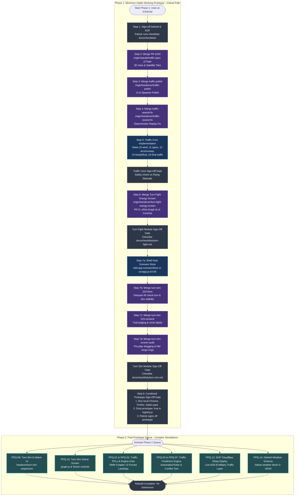

# Authoritative Completion Roadmap: Dad's Debrief Rebuild
**Project:** Dad's Debrief (OODA Loop Debrief Webtool Rebuild — Moose Jaw V6)  
**Deliverable:** Phase 1 vs. Phase 2 Completion Roadmap & Dependency Flowchart  
**Date:** 2026-09-30T20:40:00Z  
**Standard:** Verification Swarm Standards (§1.5 Citation Contract) & Streamlined Build Rules (Decisions D357–D367)  
**Output Path:** `docs/records/verification/swarm/COMPLETION_ROADMAP.md`  

---

## 1. Executive Strategy: The Two-Phase Rebuild Architecture

To finish Dad's Debrief efficiently and deliver an end-to-end working desktop webtool for Patrick and Dad without endless re-checking loops, all remaining work is organized into two distinct phases:

1. **Phase 1: Minimum Viable Working Prototype (Immediate Critical Path)**
   - Land all preserved, already-built handover branches.
   - Build the core flight features of Traffic Pattern Sim (wind, aircraft types, the break, and traffic on final).
   - Resolve integration mismatches (`app.scenarioStore`, `prototype: true`).
   - Deliver all 5 modules in a functional, clickable state on desktop browsers.
   - Execute Patrick's combined prototype sign-off.
2. **Phase 2: Post-Prototype Enhancements & Deep Simulations**
   - Execute items from `docs/records/verification/swarm/POST_PROTOTYPE_QUEUE.md`.
   - Implement advanced features (PFLs, engine-outs, prediction rules, G-warm sequences, and solver graphs) without delaying the initial prototype.

---

## 2. End-to-End Master Dependency Flowchart

The following Mermaid diagram maps the exact critical path, branch merges, implementation tasks, sign-off gates, and Phase 2 transitions:



---

## 3. PR-by-PR Critical Path Execution (Phase 1)

Every PR is executed strictly under the **Streamlined Build Rules** (Patrick, Decisions D357–D367):
- One module builds at a time.
- Standard test tolerances apply (about ±1 kt, ±50 ft, ±1°, ±1%).
- PRs merge automatically once GitHub CI is green.
- No heavy stress runs, mutation runs, or fuzzing.

### PR 1: Debrief & SOF Sign-Off Gate (Process Gate)
- **Nature:** Procedural sign-off; zero new application code required.
- **Repository State:** Both modules are fully built, verified, and live on `main` (`debrief` through #241, `sof` through #238).
- **Prerequisite Actions:**
  1. Bulk update `tasks/sof/todo.md` to check off completed tasks 1, 2, 4–10.
  2. Add `prototype: true` to `src/shell/registry.js:14-21` for `debrief` until final prototype sign-off.
- **Verification:** Patrick runs `docs/checklists/debrief.md` and `docs/checklists/sof.md` on the live site.

---

### PR 2: Traffic Sim Satellite Photo & 3D View
- **Branch:** `origin/claude/traffic-spec-j17uqw` (PR #229, tip `13f2397`).
- **Diff:** 18 files changed, +2,441 lines, −30 lines.
- **Artifacts Landed:**
  - `src/modules/traffic/view3d.js` (897 lines) — Three.js 3D perspective simulator view.
  - `src/modules/traffic/map2d.js` (+103 lines) — Esri satellite photo tile layer with offline fallback.
  - `tests/unit/traffic/view3d.test.js` (544 lines).
  - `tests/e2e/traffic.spec.js` (+360 lines).
- **Merge Steps:**
  1. Bring latest `main` into branch: `git merge origin/main`.
  2. Resolve any non-logic conflicts with a merge commit.
  3. Verify GitHub CI green.
  4. Merge into `main`.

---

### PR 3: Traffic Sim Polish Batch
- **Branch:** `origin/handover/traffic-polish` (tip `68e59d9`).
- **Diff:** 27 files changed, +1,453 lines, −110 lines.
- **Artifacts Landed:**
  - `src/modules/traffic/aircraft.js` (+29 lines) — Spawner input validation.
  - `src/modules/traffic/playback-bar.js` (+21 lines) — Responsive wrapping for 2D/3D controls.
  - `src/modules/traffic/profile-store.js` (+44 lines) — Safe localStorage parsing.
  - `tests/crosscheck/traffic-expected.json` (+308 lines).
  - `tests/e2e/traffic.spec.js` (+220 lines).
- **Merge Steps:**
  1. Rebase/merge `main` into branch.
  2. Verify tests pass (`npm test`).
  3. Merge into `main`.

---

### PR 4: Traffic Sim Rewind Fix
- **Branch:** `origin/handover/traffic-rewind-fix` (tip `eed055b`).
- **Diff:** 9 files changed, +676 lines, −59 lines.
- **Artifacts Landed:**
  - `src/modules/traffic/sim.js` (+189 lines) — Spawning, removals, and Clear Finished as deterministic timed events; sliced replay during route editing.
  - `src/modules/traffic/index.js` (+51 lines).
  - `tests/unit/traffic/rewind.test.js` (+422 lines).
- **Merge Steps:**
  1. Rebase/merge `main` into branch.
  2. Verify tests pass (`npm test`).
  3. Merge into `main`.

---

### PR 5: Traffic Core Streamlined Build
- **Target Tasks:**
  - **Task 10 (Wind):** Wind speed/direction applied to aircraft ground track and bank angles (±1 kt, ±1°).
  - **Task 11 (Aircraft Types):** Harvard II (T-6A) performance profiles, pattern airspeeds, and bank limits.
  - **Task 12 (Decided Changes):** True circular arcs, left/right hand per runway, 60° break entry, RWY 11R/28L alignment.
  - **Task 15 (Break & Final Turn):** Break turn altitude profile and descending final turn. Resolves 4 `test.todo` items in `plausibility.test.js:6-9`.
  - **Task 18 (Traffic on Final):** Spacing and rollout separation on final approach. Resolves 4 `test.todo` items in `plausibility.test.js:10-13`.
- **Scope Boundary:** No PFLs, no engine-outs, no prediction engine (all deferred to Phase 2).
- **Verification:** Unit tests, e2e browser test, and short safety check against flying manuals.

---

### PR 6: Turn Fight Energy Mode Screen
- **Branch:** `origin/handover/turn-fight-energy-screen` (tip `226729d`).
- **Diff:** 18 files changed, +2,893 lines, −63 lines.
- **Artifacts Landed:**
  - `src/modules/turn-fight/energy-graph.js` (223 lines) — uPlot altitude profile graph.
  - `src/modules/turn-fight/energy-readouts.js` (168 lines) — Energy readouts and winner determination.
  - `src/modules/turn-fight/layout.js` (+264 lines) — Energy settings menu and controls.
  - `src/modules/turn-fight/state.js` (+250 lines) — Energy state machine.
  - `tests/e2e/turn-fight.spec.js` (+610 lines) — 18 Playwright Energy tests.
  - `tests/unit/turn-fight/energy-*.test.js` (1,080 lines across 6 test suites).
- **Implementation Steps to Complete:**
  1. Merge `main` into branch.
  2. In `src/modules/turn-fight/state.js`, wire `topKiasAt` to `energyTopKias` (from `energy-sim.js`).
  3. Add unit test for engine setup error catch.
  4. Add polling intervals to Split S e2e test.
  5. Verify CI green, merge into `main`. Patrick runs `docs/checklists/turn-fight.md`.

---

### PR 7: Turn Sim Core Fixes & Screen Audit
- **Sequential Merges:**
  1. **PR 7a (Shell Host Service):** In `src/app.js:43-56`, add `scenarioStore: store.scope('scenarios')` to `createHost`.
  2. **PR 7b (`turn-sim-223-fixes`, tip `f18cac1`):** Guard check turn to 45° angle only; fix offset box collapse at 6,000 ft aft.
  3. **PR 7c (`turn-sim-215-recheck`, tip `a3a62b6`):** In-place 90 trail judging, note fallback, circle label collision avoidance.
  4. **PR 7d (`turn-sim-screen-audit`, tip `b568d0f`):** Pre-play wingman dragging (`drag.js`), NM range rings (`rings.js`), Playwright a11y tests.
- **Scope Boundary:** Turn Sim sequences (`handover/turn-sim-sequences`) is preserved and deferred to Phase 2 (PPQ-09).
- **Verification:** 105 Chrome e2e tests pass. Patrick runs `docs/checklists/turn-sim.md`.

---

### PR 8: Prototype Combined Sign-Off Gate
- **Purpose:** Official transition to completed Prototype.
- **Actions:**
  1. Run full local browser test pass across **Chrome, Firefox, and Safari** (Patrick, Decision D358).
  2. Remove `prototype: true` flag from all modules in `src/shell/registry.js:14-58`.
  3. Verify all 5 home-screen cards display as production modules without badges.
  4. Patrick signs off Phase 1 prototype.

---

## 4. Phase 2 Execution Sequence (Post-Prototype Enhancements)

Following prototype sign-off, Phase 2 implements deferred capabilities using the step-by-step guides in `docs/records/verification/swarm/POST_PROTOTYPE_QUEUE.md`:

```
Phase 2 Sequence:
1. Turn Sim Enhancements:
   - PR 2.1: Turn Sim G-Warm UI (Resume branch handover/turn-sim-sequences, PPQ-09)
   - PR 2.2: Turn Sim Spacing Graph & Solver UI (PPQ-10)
   - PR 2.3: SMM Dynamic Maneuvers: Rejoins, Fighting Wing (PPQ-11)
2. Traffic Sim Deep Simulations:
   - PR 2.4: Practice Forced Landings (PFLs, PPQ-01)
   - PR 2.5: Simulated Engine-Outs & Glide Trajectories (PPQ-02)
   - PR 2.6: Prediction Engine & Automated SMM Pattern Rules (PPQ-03, PPQ-04, PPQ-05)
   - PR 2.7: Set Up a Conflict Tool & Engine-Out Reach Layer (PPQ-06, PPQ-07)
   - PR 2.8: Custom Ordered Aircraft Plans (PPQ-08)
3. Operations & Debrief Polish:
   - PR 2.9: SOF Cloudflare Relay Deployment (PPQ-12)
   - PR 2.10: Debrief Native Weather File Schema (PPQ-14)
   - PR 2.11: Turn Fight Chaser Dynamic Pursuit AI (PPQ-15)
```

---

## 5. Alignment with Streamlined Build Rules

| Streamlined Build Rule | Implementation in Roadmap |
| :--- | :--- |
| **One module at a time (D357)** | Strict sequential order: Traffic foundation -> Traffic core -> Turn Fight -> Turn Sim. |
| **Testing once at end of module (D358)** | Single end-of-module verification check per module; per-PR checks require only green CI. |
| **Verification covers safety & numbers (D359)** | Targeted verification of pattern geometry, speeds, and altitudes against flying manuals. |
| **Tolerances allowed (D361, D362)** | Tests allow ±1 kt, ±50 ft, ±1°, and ±1% using `tests/helpers/tolerances.js`. |
| **Traffic builds core only (D363)** | PFLs, engine-outs, prediction, and closed pattern cleanly segregated to Phase 2. |
| **No heavy stress runs (D364)** | 12-hour soak tests and mutation runs excluded from Phase 1. |
| **3D is a bonus (D365)** | PR #229 merged to preserve built 3D code; no additional 3D polish required. |
| **New ideas to future list (D366)** | All enhancements registered in `POST_PROTOTYPE_QUEUE.md`. Zero scope creep into Phase 1. |
