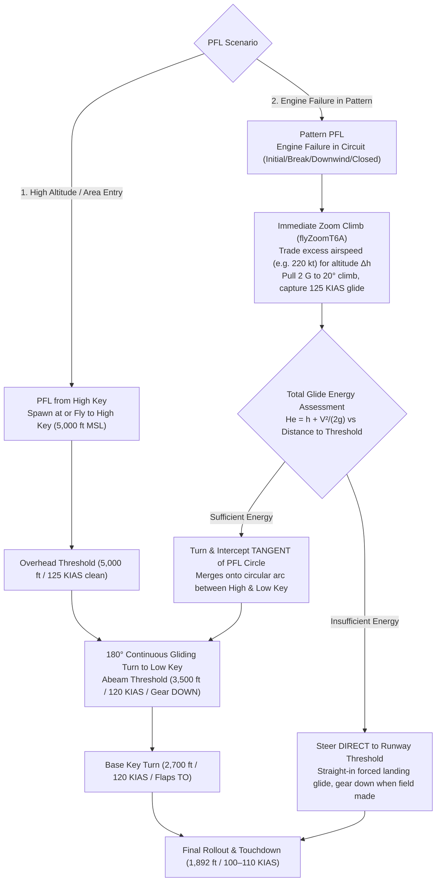

# 15 Wing Moose Jaw — Master Traffic Pattern Matrix & Flight Procedures

**Document ID:** `docs/traffic-pattern-matrix.md`  
**Aircraft Baseline:** CT-156 Harvard II (Beechcraft T-6A)  
**Airfield Baseline:** CFB Moose Jaw (CYMJ) — Runway 29L (298° True), Field Elevation 1,892 ft MSL  
**Primary Flight Orders:** 15 Wing SMM Chapters 4, 13, 14, 16 & Ratified Decisions D370–D391  
**Module Reference:** `src/modules/traffic/` (Traffic Pattern Sim)

---

## 1. Authoritative Pattern Matrix

| Pattern ID | Pattern Name | Operational Role | Key Altitudes (MSL) | Airspeed Profile (KIAS) | Turn Bank & G Envelope | Ground Track & Geometry | Key Triggers & Gates |
| :--- | :--- | :--- | :--- | :--- | :--- | :--- | :--- |
| **`PAT1`** | **Inner Overhead Break & Closed Circuit** | Primary visual training circuit for military fast-jet lead-in | • Initial: 3,500 ft • Break: 3,500 ft • Downwind: 3,500 ft • Final Turn: 3,500 → 2,700 ft • Threshold: 1,892 ft | • Initial: 220 kt • Break Bleed: 220 → 140 kt • Downwind: 140 kt • Perch/Turn: 120 kt • Threshold: 100 kt | • Break: 60° bank, 2.0 G level • Perch/Turn: 35° bank (30°–45° closed-loop) • Closed Turn: 50° bank, 10°–15° pitch | • Compact oval (~1.2–1.5 NM spacing) • Dynamic wind-drifted perch ($\vec{P}_{\text{perch}}$) • 3.0° glide slope intercept at 2.54 NM | • Break Point 9: +2,048 ft past threshold • Rollout downwind at 180° turn (118° true) • Closed climb: +4,000 ft past departure end |
| **`PAT_OUTER`** | **Outer Rectangular Pattern** | Wide instrument, lost-comms, or standard rectangular training box | • Pattern: 3,500 ft • Base: 3,500 → 2,700 ft • Final: 2,700 → 1,892 ft | • Climbout: 180 kt • Downwind: 220 kt • Base Leg: 140 kt • Final: 120 → 100 kt | • Upwind/Crosswind: 60° bank, 2.0 G • Base/Final turns: 45° bank (1.41 G) | • Wide rectangular box (~3.5–4.0 NM lateral spacing) • Centerline $y \approx -24,000\text{ to } -28,000\text{ ft}$ | • Crosswind turn at departure end • 90° square base turn abeam perch |
| **`PAT_SI`** | **Straight-In Recovery Pattern** | Formal straight-in approach from outer pattern or visual rejoin | • Downwind: 3,500 ft • Step-down: 3,500 → 2,700 ft • Final: 2,700 ft level to glide slope intercept | • Downwind: 220 kt • Dogleg/Base: 140 kt • Final: **120 kt until 0.75 NM** • Threshold: 100 kt | • Base turn: 45° bank (1.41 G) • Final turn: 45° bank (1.41 G) • Straight wings-level final | • Extended downwind (past `PAT_OUTER`) • Long straight-in final (~4.0–6.0 NM) • 3.0° glide slope descent | • **Abeam departure end:** Initiate descent to 2,700 ft • **0.75 NM Gate:** Hold 120 kt until 0.75 NM from threshold, then slow to 100 kt |
| **`PAT_BREAKOUT`**| **Circuit Breakout Procedure** | Controlled departure from pattern for traffic avoidance / re-entry | • Initial: Pattern altitude • Climbing turn: Climb to 3,500–4,500 ft MSL | • Accelerate from pattern speed (120–140 kt) to **140–180 kt** cruise climb | • 30°–45° bank climbing turn • Coordinated climb ~1,500–2,000 fpm | • Vectors toward **$\vec{P}_{\text{breakout}}$: 2.0 NM south of outer pattern center (perpendicular)** • Re-enters via VFR entry gates (ENT1/ENT2) | • Commanded via "Breakout" button or traffic conflict • Does NOT turn 90°; flies dedicated radial vector |
| **`PAT_PFL_HIGH_KEY`** | **PFL from High Key** | Standard high-altitude forced landing procedure from MOA / training area | • High Key: 5,000 ft MSL • Low Key: 3,500 ft MSL • Base Key: 2,700 ft MSL • Final: 1,892 ft MSL | • High to Low Key: 125 kt (clean glide) • Low to Base Key: 120 kt (gear down) • Final: 100–110 kt | • 30°–40° continuous gliding turns • Zero thrust, feather/windmill sink rate ($\sim 1,000\text{–}1,200\text{ fpm}$) | • 360° overhead spiraling oval • Offset ~1.0 NM abeam threshold at Low Key | • Spawns AT High Key or flies inbound to High Key • High Key: Directly overhead threshold at 5,000 ft • Low Key: 3,500 ft abeam threshold, gear down |
| **`PAT_PFL_PATTERN`** | **Pattern PFL (In-Circuit Engine Failure)** | Low-altitude emergency landing from within active circuit | • Immediate Zoom Climb (trades excess speed for altitude) • Tangent Intercept or Direct Threshold descent | • Zoom: Pull 2 G to 20° climb (bleed to 125 kt) • Glide: 125 kt clean, 120 kt gear down | • Coordinated pull-up into zoom climb • Bank towards tangent or threshold | • Dynamic vector branching:   1. **Intercept Tangent** of PFL circle (if energy sufficient)   2. **Direct to Threshold** (if energy insufficient) | • Triggered anywhere in circuit (Initial, Break, Downwind, Closed) • Uses `core/t6-performance.js: flyZoomT6A` • Energy check determines Tangent vs Direct |

---

## 2. Deep-Dive Specification by Procedure

### 2.1 `PAT1`: The Inner Overhead Break & Closed Circuit
- **Guidance Doctrine:**
  - **Initial:** Localizer pursuit along runway centerline extended ($298^\circ$ true).
  - **Break Turn:** Open-loop 2.0 G level coordinated turn through $180^\circ$. Airmass drift $\vec{W} \cdot t$ applied continuously.
  - **Downwind:** Pure pursuit tracking to dynamic wind-shifted perch $\vec{P}_{\text{perch}} = \vec{P}_{\text{perch, calm}} - \vec{W} \cdot T_{\text{turn}}$.
  - **Final Turn:** Continuous cubic descent from $3,500\text{ ft} \to 2,700\text{ ft MSL}$ with closed-loop cross-track steering modulating bank between $30^\circ$ and $45^\circ$.
  - **Straight Final:** Intercepts 3.0° glide slope at $2.54\text{ NM}$ ($15,417\text{ ft}$) from threshold at $2,700\text{ ft MSL}$, decelerating $120 \to 100\text{ KIAS}$ at touchdown ($1,892\text{ ft MSL}$).
  - **Closed Pattern:** Advances power past departure end ($+4,000\text{ ft}$), climbs at $35\text{ ft/s}$ ($2,100\text{ fpm}$) with $50^\circ$ bank turn, rolling out wings level at $3,500\text{ ft MSL}$ on downwind heading direct to $\vec{P}_{\text{perch}}$.

### 2.2 `PAT_OUTER`: The Outer Box / Rectangular Pattern
- **Operational Purpose:** Flown for wide instrument patterns, formation lost-wingman procedures, and initial crosswind training.
- **Lateral Spacing:** Wide rectangular corridor situated $\sim 3.5\text{–}4.0\text{ NM}$ south of Runway 29L ($y \approx -24,000\text{ to } -28,000\text{ ft}$ in local coordinates).
- **Altitude & Speed:**
  - Takeoff and climb straight ahead to $2,500\text{ ft MSL}$, turning crosswind to level at $3,500\text{ ft MSL}$ at $220\text{ KIAS}$.
  - Cruising downwind at $3,500\text{ ft MSL}$ / $220\text{ KIAS}$.
  - 90° rectangular base turn slowing from $220 \to 140\text{ KIAS}$ and descending $3,500 \to 2,700\text{ ft MSL}$.
  - Final turn to line up on extended centerline at $2,700\text{ ft MSL}$ / $120\text{ KIAS}$.

### 2.3 `PAT_SI`: The Straight-In Pattern (Abeam Departure End Step-Down & 0.75 NM Gate)
- **Abeam Departure End Step-Down:**  
  When an aircraft flying downwind reaches the point directly abeam the departure end of Runway 29L, it initiates a smooth descent from **$3,500\text{ ft down to } 2,700\text{ ft MSL}$**, leveling off at $2,700\text{ ft MSL}$.
- **Downwind Extension:**  
  The straight-in downwind leg extends **further out than `PAT_OUTER`** before initiating the dogleg/base turn, providing ample straight track distance to stabilize on final.
- **The 0.75 NM Speed Gate (Critical Domain Rule):**  
  * The aircraft rolls out on the extended runway centerline at **$2,700\text{ ft MSL}$ and maintains $120\text{ KIAS}$**.
  * It does **NOT** decelerate early. It maintains $120\text{ KIAS}$ all the way down the final corridor until it is **$0.75\text{ NM}$ ($4,558\text{ ft}$)** from the runway threshold.
  * Only when passing the $0.75\text{ NM}$ gate (the Window) does it bleed speed from **$120\text{ KIAS} \to 100\text{ KIAS}$** for threshold crossing and touchdown.

### 2.4 `PAT_BREAKOUT`: Circuit Breakout Procedure
- **Trigger:** Initiated whenever the pilot/instructor selects "Breakout", or when safety separation requires breaking out of the circuit.
- **Flight Kinematics:**
  - Initiates an immediate **climbing turn** (30°–45° bank, coordinated pitch $10^\circ$, climb rate $1,500\text{–}2,000\text{ fpm}$).
  - Climbs from current circuit altitude to **$3,500\text{ ft MSL}$** (or assigned VFR re-entry transit altitude).
  - Accelerates from pattern speed to **$140\text{–}180\text{ KIAS}$**.
- **Vector Guidance (Patrick's Clarification):**
  - **Does NOT execute a 90° turn.**
  - Instead, steers on a direct intercept heading toward **$\vec{P}_{\text{breakout}}$**, defined as:
    $$\vec{P}_{\text{breakout}} = \vec{C}_{\text{outer}} + 2.0\text{ NM} \cdot \hat{n}_{\text{south}}$$
    where $\vec{C}_{\text{outer}}$ is the geometric center of the Outer Pattern, and $\hat{n}_{\text{south}}$ is the perpendicular unit vector directed south away from the runway complex (heading $\approx 208^\circ$ true).
  - Once reaching the breakout point ($2.0\text{ NM}$ south of the outer pattern), the aircraft routes smoothly into the standard VFR entry gates:
    - **`ENT1`:** Extended line to the base leg of the **Outer Pattern (`PAT_OUTER`) at $3,500\text{ ft MSL}$**.
    - **`ENT2`:** Extended line to the base leg of the **Straight-In Pattern (`PAT_SI`) at $2,700\text{ ft MSL}$**.

### 2.5 `PAT_GO_AROUND`: Authentic Wave-Off Climbout Procedure
- **Trigger:** Initiated whenever the pilot/instructor selects "Go-around", or upon safety wave-off on final approach.
- **Flight Kinematics (Patrick's Ratified Specification):**
  - **Full Power (100% PCL):** Full power is applied immediately upon initiation and maintained throughout the entire climbout and pattern rejoin.
  - **Initial Climb to 2,500 ft MSL:** Climbs straight ahead along runway axis ($298^\circ$ true) at $\sim 140\text{ KIAS}$ up to **$2,500\text{ ft MSL}$**.
  - **Level Acceleration to Departure End:** Once reaching $2,500\text{ ft MSL}$, levels off and accelerates under full power along the runway axis toward the departure end (accumulating excess kinetic energy).
  - **Departure End Zoom Climb:** Exactly at the departure end of Runway 29L, pulls into a climb trading excess speed for rapid altitude gain until speed stabilizes at **$180\text{ KIAS}$**, continuing the climb to **$3,500\text{ ft MSL}$**.
  - **Level Off & Acceleration to 220 KIAS:** Upon reaching $3,500\text{ ft MSL}$, levels off and accelerates under full power to **$220\text{ KIAS}$**.
  - **Outer Pattern Rejoin:** Rolls into a coordinated crosswind turn to join downwind of the **Outer Pattern (`PAT_OUTER`)** at $3,500\text{ ft MSL}$ / $220\text{ KIAS}$. Zero coordinate teleportation.

### 2.6 `PAT_PFL`: Practice Forced Landing Patterns (The Two Authentic Types)

#### Type 1: `PAT_PFL_HIGH_KEY` (PFL from High Key)
- **Concept:** Standard full-procedure forced landing practiced when returning from the tactical training areas.
- **Entry Modes:**
  1. **Spawn AT High Key:** Aircraft initializes directly overhead Runway 29L threshold at $5,000\text{ ft MSL}$, $125\text{ KIAS}$, heading $298^\circ$ (runway axis).
  2. **Fly Inbound to High Key:** Aircraft navigates from the MOA/area descending/gliding toward the airfield cone of safety, intercepting the overhead threshold fix at $5,000\text{ ft MSL}$.
- **Profile:**
  - **High Key ($5,000\text{ ft MSL}$ / $125\text{ KIAS}$):** Clean configuration ($L/D_{\max} \approx 12:1$, $2.0\text{ NM}$ per $1,000\text{ ft}$).
  - **Low Key ($3,500\text{ ft MSL}$ / $120\text{ KIAS}$):** Continuous descending turn abeam threshold ($1.0\text{ NM}$ offset). Select gear DOWN, flaps TO.
  - **Base Key ($2,700\text{ ft MSL}$ / $120\text{ KIAS}$):** Descending base turn. Flaps as required.
  - **Final Key & Rollout:** Touchdown at $1,892\text{ ft MSL}$, $100\text{–}110\text{ KIAS}$.

#### Type 2: `PAT_PFL_PATTERN` (Pattern PFL / In-Circuit Engine Failure)
- **Concept:** Critical emergency procedure when the engine fails while operating inside the visual circuit (on Initial, in the Break, on Downwind, or on Closed Pattern climb).
- **Phase 1: Immediate Zoom Maneuver (`src/core/t6-performance.js: flyZoomT6A`)**
  - Converts excess kinetic energy ($V_{\text{ias}} > 125\text{ KIAS}$) into potential altitude ($\Delta h$):
    - If $V_{\text{ias}} > 150\text{ KIAS}$ (e.g. Initial at 220 kt): 2 G pull to $20^\circ$ nose-up climb, held until 145 KIAS, then 0.25 G push-over to capture $125\text{ KIAS}$ clean glide. Gaining up to $\sim 800\text{–}1,200\text{ ft}$ of altitude.
    - If $V_{\text{ias}} \le 150\text{ KIAS}$ (e.g. Downwind at 140 kt): Level deceleration to $125\text{ KIAS}$.
- **Phase 2: Energy Gate & Branching Strategy**
  - The flight computer computes the specific energy height $H_e = h + \frac{V^2}{2g}$ relative to the threshold.
  - **Branch A: Intercept Tangent to PFL Circle (High Energy)**
    - If $H_e \ge H_{\text{circle, required}}$, the aircraft calculates the geometry of the standard PFL circle (radius $R_{\text{pfl}} \approx 6,000\text{ ft}$) and calculates the **tangent vector** from its current post-zoom position to the circle.
    - Turns smoothly to intercept this tangent, joining the circular profile between High Key and Low Key (or directly into Low Key).
  - **Branch B: Direct to Threshold (Low Energy / Low Altitude)**
    - If $H_e < H_{\text{circle, required}}$ (e.g. engine failure at low altitude or late in the circuit), attempting to fly the circular pattern would result in an off-field landing / crash.
    - The aircraft abandons the circular arc and **turns directly toward the Runway 29L threshold**, gliding straight-in at best glide ($125\text{ KIAS}$), lowering gear and flaps only when reaching the runway threshold is assured.

---

## 3. Synthesis: Retiring Legacy V6 Hacks & Route Decoupling Plan

| Legacy V6 Artifact / Hack | Problem / Flaw | Authentic Replacement |
| :--- | :--- | :--- |
| **Combined `PAT1` (Pts 0–8 Outer + 9–12 Inner)** | Single polyline forced aircraft to jump 22,000 ft across the circuit or fly a 4.6 NM outer box when "Pattern 1" was selected. | Split into two independent, first-class routes: `PAT1` (Inner Overhead Break & Closed Circuit) and `PAT_OUTER` (Outer Box Pattern). |
| **`SPL3` ("Split 3" Closed Pattern Shortcut)** | Crude 2-point polyline shortcut from Departure End to Downwind with zero climb physics or roll dynamics. | Replaced by authentic CT-156 Harvard II closed-pattern climbing turn ($50^\circ$ bank, $10^\circ\text{–}15^\circ$ pitch, $35\text{ ft/s}$ climb to $3,500\text{ ft MSL}$, pure pursuit rollout to $\vec{P}_{\text{perch}}$). |
| **`SPL1` ("Split 1" Straight-In Shortcut)** | Concealed the actual Moose Jaw straight-in recovery as an arbitrary split branch. | Formalized as first-class `PAT_SI` route with abeam departure end step-down ($3,500 \to 2,700\text{ ft}$) and the $0.75\text{ NM}$ $120\text{ kt}$ speed gate. |
| **`SPL2` ("Split 2" Breakout Polyline)** | Clunky dogleg line that didn't climb properly and ended abruptly in an outer entry. | Upgraded to dynamic vector breakout steering to a point $2.0\text{ NM}$ perpendicular south of outer pattern center, then transitioning to entry corridors. |
| **`ENT4` ("Entry 4" PFL Placeholder)** | Disguised high-altitude entry starting at 5,000 ft with fixed steps. | Replaced by dedicated `PAT_PFL` with High Key ($5,000\text{ ft}$), Low Key ($3,500\text{ ft}$), Base Key ($2,700\text{ ft}$), and $T6A\_GLIDE$ physics. |
