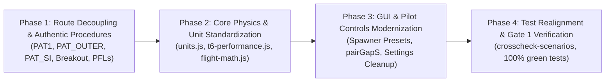

# Master Remediation Execution Plan: Traffic Architecture, Core Integration & GUI Modernization

**Document ID:** `tasks/traffic/remediation-plan.md`  
**Parent Specifications:** `specs/SPEC-traffic-vector.md`, `specs/SPEC-traffic.md`  
**Authoritative Reference:** [`docs/traffic-pattern-matrix.md`](file:///c:/Users/patri/Documents/antigravity/wise-mendeleev/Dads-debreif/docs/traffic-pattern-matrix.md)  
**Living Task Checklist:** [`tasks/traffic/remediation-todo.md`](file:///c:/Users/patri/Documents/antigravity/wise-mendeleev/Dads-debreif/tasks/traffic/remediation-todo.md)  
**Applicability:** `src/modules/traffic/` & `src/core/`  
**Skills Applied:** `planning-and-task-breakdown`, `incremental-implementation`, `test-driven-development`  

---

## 1. Executive Summary & Purpose

This execution plan resolves the architectural anomalies, legacy V6 hacks, core math redundancies, and UI discrepancies identified during the comprehensive technical audits. Work is structured into **four sequential, thin, verifiable phases**, allowing continuous verification without destabilizing the working test suite.

---

## 2. Segmented Phased Breakdown

### Phase 1: Route Decoupling & Authentic Procedures (The V6 Route Deception)

#### Objective
Eliminate the legacy V6 polyline hacks (`SPL1`, `SPL2`, `SPL3`, `SPL4`, `ENT4`, and the 22,723-ft chord jump in `PAT1`) in [`src/modules/traffic/data/moose-jaw.json`](file:///c:/Users/patri/Documents/antigravity/wise-mendeleev/Dads-debreif/src/modules/traffic/data/moose-jaw.json), establishing clean first-class military flight procedures.

* **Slice 1.1: Route Decoupling in `moose-jaw.json`**
  - **`PAT1` (Inner Visual Circuit):** 5-point authentic military circuit:
    1. *Threshold* $(3104, -3194)$, $1,892\text{ ft MSL}$, $100\text{ KIAS}$
    2. *Departure End* $(-4066, 681)$, $2,500\text{ ft MSL}$, $140\text{ KIAS}$
    3. *Break Point 9* $(-288, -1441)$, $3,500\text{ ft MSL}$, $220\text{ KIAS}$ ($+2,048\text{ ft}$ past threshold)
    4. *Inner Downwind / Perch* $(7146, -10275)$, $3,500\text{ ft MSL}$, $140 \to 120\text{ KIAS}$
    5. *Final Window* $(9076, -6411)$, $2,150\text{ ft MSL}$, $110\text{ KIAS}$
  - **`PAT_OUTER` (Outer Rectangular Pattern):** Dedicated 4-point wide radar/instrument circuit ($\sim 3.5\text{–}4.0\text{ NM}$ lateral offset, $y \approx -24,000\text{ to } -28,000\text{ ft}$).
  - **`PAT_SI` (Straight-In Recovery):** Independent route incorporating the abeam departure end step-down ($3,500 \to 2,700\text{ ft MSL}$) and long final corridor.
  - **`PAT_BREAKOUT` (Circuit Breakout):** Route/procedure heading to $\vec{P}_{\text{breakout}}$ (2.0 NM perpendicular south of outer pattern center).
  - **`PAT_PFL_HIGH_KEY` & `PAT_PFL_PATTERN`:** Dedicated PFL profiles (High Key 5,000 ft overhead threshold vs. Pattern PFL with Zoom & Tangent/Threshold branching).
  - **Re-anchor External Routes (ENT1 & ENT2):**
    - `ENT1`: Extended line to the base leg of the **Outer Pattern (`PAT_OUTER`) at $3,500\text{ ft MSL}$**.
    - `ENT2`: Extended line to the base leg of the **Straight-In Pattern (`PAT_SI`) at $2,700\text{ ft MSL}$**.

* **Slice 1.2: Straight-In 0.75 NM Speed Gate Implementation**
  - In [`sim.js: fly(a)`](file:///c:/Users/patri/Documents/antigravity/wise-mendeleev/Dads-debreif/src/modules/traffic/sim.js), enforce the 15 Wing SMM Ch 16 speed gate for straight-in approaches:
    - Hold $120\text{ KIAS}$ level at $2,700\text{ ft MSL}$ down the final corridor.
    - Maintain $120\text{ KIAS}$ until distance to threshold $\le 0.75\text{ NM}$ ($4,558\text{ ft}$).
    - Bleed from $120 \to 100\text{ KIAS}$ across the $0.75\text{ NM}$ window to touchdown.

* **Slice 1.3: Authentic Breakout Vector Guidance**
  - Replace the legacy 118° heading hack in [`sim.js:270-294`](file:///c:/Users/patri/Documents/antigravity/wise-mendeleev/Dads-debreif/src/modules/traffic/sim.js#L270-L294):
    - Calculate outer pattern center $\vec{C}_{\text{outer}}$ and perpendicular south vector $\hat{n}_{\text{south}}$ ($\sim 208^\circ$ true).
    - Set target $\vec{P}_{\text{breakout}} = \vec{C}_{\text{outer}} + 12,152\text{ ft} \cdot \hat{n}_{\text{south}}$.
    - Fly coordinated climbing turn ($30^\circ\text{–}45^\circ$ bank, $+10^\circ$ pitch, climbing to $3,500\text{ ft MSL}$, accelerating to $140\text{–}180\text{ KIAS}$) vectoring directly toward $\vec{P}_{\text{breakout}}$.
    - From $\vec{P}_{\text{breakout}}$, provide seamless visual intercept into `ENT1` (at 3,500 ft to outer base) or `ENT2` (descending to 2,700 ft to straight-in base).

* **Slice 1.4: Authentic Go-Around Wave-Off Climbout**
  - Replace instant teleportation in [`sim.js:820-841`](file:///c:/Users/patri/Documents/antigravity/wise-mendeleev/Dads-debreif/src/modules/traffic/sim.js#L820-L841) with authentic Moose Jaw wave-off vector:
    - Advance full power (100% PCL) upon initiation and hold full power throughout.
    - Climb straight ahead along runway axis ($298^\circ$ true) at $\sim 140\text{ KIAS}$ to $2,500\text{ ft MSL}$.
    - At $2,500\text{ ft MSL}$, level off and accelerate under full power down runway axis toward departure end.
    - Exactly at departure end, zoom climb trading excess speed for rapid altitude gain until speed stabilizes at $180\text{ KIAS}$, continuing climb to $3,500\text{ ft MSL}$.
    - At $3,500\text{ ft MSL}$, level off and accelerate under full power to $220\text{ KIAS}$.
    - Execute crosswind turn to roll out wings level on downwind, rejoining the **Outer Pattern (`PAT_OUTER`)**. Zero coordinate teleportation.

* **Slice 1.5: Critical Kinematic Bug Fixes**
  - **Heading-Velocity Decoupling Fix (`sim.js:426-435`):** Compute velocity vector $\dot{x}, \dot{y}$ using `(a.customHeading ?? a.headingDeg)` so physical flight matches the visual heading.
  - **State Machine Squash Fix (`sim.js:300-302`):** Stop squashing `downwind` to `initial` after closed-pattern rollout.
  - **Teleportation Trap Fix (`sim.js:413-421`):** Maintain continuous Cartesian coordinates; do not snap to outdated `distFt` arc-length.
  - **Zero-Wind Track Alignment (`route.js:271`):** Ensure calm-wind path length matches the $34,346\text{ ft}$ visual circuit.
  - **Field Elevation Standardization:** Set threshold and landing elevations to $1,892\text{ ft MSL}$ (D373/D378) throughout `sim.js`, `route.js`, and `moose-jaw.json`.

---

### Phase 2: Core Performance & Physics Integration (`src/core/`)

#### Objective
Eliminate redundant, duplicated, or arbitrary numbers in `src/modules/traffic/`, wiring standard functions from `src/core/`.

* **Slice 2.1: Units & Angles Standardization**
  - Import `G_FTPS2` (32.174) from [`src/core/units.js`](file:///c:/Users/patri/Documents/antigravity/wise-mendeleev/Dads-debreif/src/core/units.js); delete local re-definitions in `sim.js:40, 388` and `route.js:525, 612`.
  - Import `degToRad`, `radToDeg`, `wrapDeg180`, and `compassDegToHeadingRad` from [`src/core/angles.js`](file:///c:/Users/patri/Documents/antigravity/wise-mendeleev/Dads-debreif/src/core/angles.js); delete duplicate `rad()`, `deg()`, `wrapDeg()`, and `hdgRadOf()` in `view3d.js` and `route.js`.
  - Bind `a.bankDeg` directly to 3D mesh roll in [`view3d.js:456`](file:///c:/Users/patri/Documents/antigravity/wise-mendeleev/Dads-debreif/src/modules/traffic/view3d.js#L456), eliminating the 1.0 s attitude history delay.

* **Slice 2.2: T-6A Performance & Glide Dynamics**
  - In `sim.js:306-316` (`engine_fail`), import `T6A_GLIDE` and compute sink rate using `glideSinkFpm('feathered', 125, a.alt)` ($1,350\text{ fpm}$ clean feathered at 125 KIAS), replacing the arbitrary $16.7\text{ ft/s}$ ($1,000\text{ fpm}$).
  - In Pattern PFL, integrate `flyZoomT6A` / `zoomT6A` from [`src/core/t6-performance.js`](file:///c:/Users/patri/Documents/antigravity/wise-mendeleev/Dads-debreif/src/core/t6-performance.js) for realistic kinetic-to-potential energy trade.
  - Implement accelerated stall protection using `stallLimitG(kias)` and `availableG(kias)` to cap commanded bank angles at low speeds.
  - Replace magic exponential decay in the break ($220 \cdot e^{-0.452 u}$) with `dragPerWeight(ias, alt, g)` from `t6-performance.js`.

* **Slice 2.3: Flight Math & Telemetry Integration**
  - Use `turnRateRadPerSec(speedFtps, g)` from [`src/core/flight-math.js`](file:///c:/Users/patri/Documents/antigravity/wise-mendeleev/Dads-debreif/src/core/flight-math.js) in `sim.js` and `route.js`.
  - Import `closureKt` and `formatClosureKt` for conflict telemetry readouts (`sim.js` and `readouts.js`).
  - Integrate `phaseSpeedFor(a.type, a.phase)` from [`src/modules/traffic/types.js`](file:///c:/Users/patri/Documents/antigravity/wise-mendeleev/Dads-debreif/src/modules/traffic/types.js) so Hawk, Hornet, Tutor, and Astra fly their authentic speeds.

---

### Phase 3: GUI & Pilot Controls Modernization

#### Objective
Clean up broken, confusing, out-of-date, redundant, or non-functional controls across the Traffic interface.

* **Slice 3.1: Critical P0 Transport & Spawner Fixes**
  - **Playback Bar Reset Crash Fix:** In [`index.js:58-71`](file:///c:/Users/patri/Documents/antigravity/wise-mendeleev/Dads-debreif/src/modules/traffic/index.js#L58-L71), wire `reset: resetRun` into the playback bar callbacks, preventing `TypeError: on.reset is not a function`.
  - **"Fit all routes" 3D Defect Fix:** In `index.js:68`, support 3D mode: `fitAll: () => (shown === '3d' ? view3d.preset('fit') : map.fitAll())` so clicking does not manipulate a hidden 2D canvas.
  - **Spawner Custom Preset Dead State Fix:** In [`aircraft.js:137-142`](file:///c:/Users/patri/Documents/antigravity/wise-mendeleev/Dads-debreif/src/modules/traffic/aircraft.js#L137-L142), handle `chosen.id === 'custom'` explicitly rather than evaluating empty routeId to falsy and aborting.
  - **Two-Way Preset Synchronization:** Add change listeners to manual `routeSelect` and `spawnStartPoint` controls that dynamically set `presetSelect.value = 'custom'`.

* **Slice 3.2: Archival Quarantine & Obsolete Control Deprecation (P1)**
  - **Quarantine V6 Profile:** Remove `moose-jaw-v6` from `BUILT_IN` in [`profile.js:307`](file:///c:/Users/patri/Documents/antigravity/wise-mendeleev/Dads-debreif/src/modules/traffic/profile.js#L307) per Decisions D368 and D372.
  - **Remove Obsolete Route Options:** Deprecate `flyRoundedTurns`, `radiusFromG`, and `manualRadiusFt` from [`settings-panel.js`](file:///c:/Users/patri/Documents/antigravity/wise-mendeleev/Dads-debreif/src/modules/traffic/settings-panel.js#L90-L95).
  - **Remove Obsolete Photo Nudging:** Remove `photoTrim`, `photoEastFt`, `photoNorthFt` sliders that de-calibrate real-world Esri Web Mercator satellite projection.
  - **Button Label Standardization:** Relabel settings menu button to `"Reset to Standard Defaults"` per Decision D384.
  - **Type Priority Order:** Reorder `SPAWN_TYPES` in [`types.js`](file:///c:/Users/patri/Documents/antigravity/wise-mendeleev/Dads-debreif/src/modules/traffic/types.js) to place primary trainer `CT-156` first.

* **Slice 3.3: Interactive Pilot Controls & Aircraft Management (P2)**
  - **Pair Spacing UI Control:** Add number input for `pairGapS` (default 20 s) to the Spawner panel in `aircraft.js`.
  - **Individual Aircraft Removal:** Add `✕` (Remove) button to each aircraft card/row in `aircraft.js` wired to `sim.remove(id)`.
  - **Breakout Multi-Click Guard:** Disable the Breakout button once active to prevent successive 90° spin increments; add airspace boundary auto-cleanup (>10 NM).
  - **Remove Duplicate 3D Fit:** Remove duplicate `Fit` button from 3D canvas overlay (`layout.js:80`), preserving camera view presets (`High look-down`, `Low chase`).
  - **Context-Aware Drop Lines:** Grey out or hide `Height drop lines (3D)` checkbox when in 2D mode.
  - **Visual Styling Cleanup:** Add CSS rules for `.has-engine-fail` and prune dead CSS selectors in `traffic.css`.

---

### Phase 4: Test Realignment & Milestone Verification Gate

#### Objective
Guarantee 100% green test status and verify against the Gate 1 checklist.

* **Slice 4.1: Crosscheck & Unit Test Realignment**
  - Update [`tests/crosscheck/traffic-scenarios.test.js`](file:///c:/Users/patri/Documents/antigravity/wise-mendeleev/Dads-debreif/tests/crosscheck/traffic-scenarios.test.js) and re-generate `traffic-expected.json` to reflect the decoupled route architecture.
  - Run full test suite: `npm test`, `npm run typecheck`, `npm run build`.
* **Slice 4.2: Gate 1 Verification**
  - Review [`docs/checklists/traffic.md`](file:///c:/Users/patri/Documents/antigravity/wise-mendeleev/Dads-debreif/docs/checklists/traffic.md) with Patrick for final sign-off.
