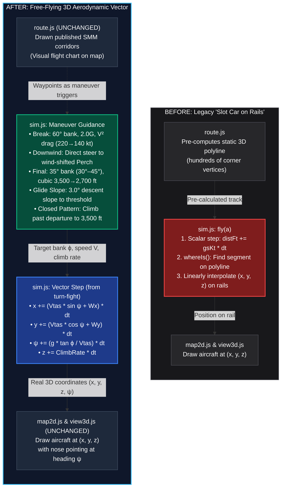
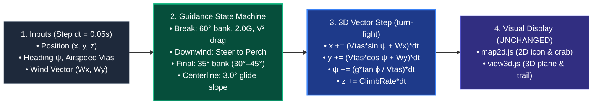
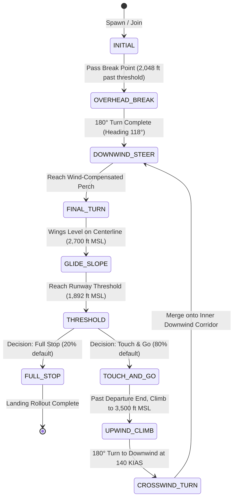

# Comprehensive Traffic Sim Vector Aerodynamics Architecture & Execution Plan

**Authoritative System Specification & Architectural Breakdown**  
**Skill Applied:** `planning-and-task-breakdown`  
**Decisions Referenced:** D370 (Closed-loop flight), D371 (Pilot domain tolerances), D373/D378 (CYMJ 29L LH ground truth), D382 (60° break, 45° final turn), D389 (Wind perch drift compensation), D390 (Vector simulation & 3D suite).

---

## 1. Executive Summary & Design Philosophy

Instead of treating aircraft as 1D "slot cars" riding along pre-computed polyline tracks (`distFt`), Traffic Sim adopts the **free-flying Cartesian 3D vector model** already proven in `turn-fight` and `turn-sim`.

* **Drawn Tracks = Visual Flight Charts:** Published SMM routes on the map remain visible as reference charts (calm-wind corridor + optional wind-drifted overlay).
* **Aircraft = Free Aerodynamic Entities:** Each aircraft navigates Cartesian space $(x, y, z)$ with airspeed $V_{\text{ias}}$, true airspeed $V_{\text{tas}}$, heading $\psi$, bank $\phi$, and vertical speed $\dot{z}$ in a moving airmass $\vec{W} = (W_x, W_y)$.
* **Waypoints = Guidance Anchors & Maneuver Triggers:** Waypoints trigger pilot maneuvers (rolling into the break, initiating final turn, capturing glide slope, rolling landing decision) and act as navigational attractors rather than physical rails.
* **Scope Isolation (Zero Code Rewrites):** Over 90% of the module codebase (`layout.js`, `map2d.js`, `view3d.js`, `playback-bar.js`, `editor.js`, `types.js`, etc.) remains **completely untouched**. Only the `fly(a)` stepping function inside `src/modules/traffic/sim.js` is updated from polyline distance sampling to Cartesian vector integration.

---

## 2. Code Architecture: Before vs. After Recode

---

## 3. Clean Execution Pipeline Flowchart (Every 0.05s Step)

---

## 4. Core Physics Equations (Borrowed from `turn-fight` & `turn-sim`)

### 4.1 The 3D Cartesian Step Integrator
Every 0.05 seconds (`dt = 0.05 s`):
1. **True Airspeed Conversion:**
   $$V_{\text{tas}} = \text{iasToTasKt}(V_{\text{ias}}, z_{\text{MSL}})$$
   $$\text{Airspeed in ft/s: } v_{\text{air}} = V_{\text{tas}} \cdot \frac{6076.12}{3600}$$
2. **Moving Airmass Wind Vector:**
   $$\vec{W} = \begin{bmatrix} W_x \\ W_y \end{bmatrix} = \begin{bmatrix} -V_{\text{wind}} \cdot \sin(\theta_{\text{wind\_from}}) \cdot \frac{6076.12}{3600} \\ -V_{\text{wind}} \cdot \cos(\theta_{\text{wind\_from}}) \cdot \frac{6076.12}{3600} \end{bmatrix}$$
3. **Ground Velocity & Position Integration:**
   $$\begin{aligned}
   \dot{x} &= v_{\text{air}} \cdot \sin\psi \cdot \cos\theta + W_x \\
   \dot{y} &= v_{\text{air}} \cdot \cos\psi \cdot \cos\theta + W_y \\
   \dot{z} &= v_{\text{air}} \cdot \sin\theta
   \end{aligned}$$
   $$x_{t+dt} = x_t + \dot{x} \cdot dt, \quad y_{t+dt} = y_t + \dot{y} \cdot dt, \quad z_{t+dt} = z_t + \dot{z} \cdot dt$$
4. **Turn Kinematics (Coordinated Turn):**
   $$\omega = \frac{g \cdot \tan\phi}{v_{\text{air}}} \quad \implies \quad \psi_{t+dt} = \psi_t + \omega \cdot dt$$
5. **Ground Track & Visual Crab:**
   $$\text{Ground Track } \tau = \text{atan2}(\dot{x}, \dot{y})$$
   $$\text{Crab Angle } \theta_{\text{crab}} = \psi - \tau$$
   *The aircraft visual icon points along true nose heading $\psi$ (crabbed into wind), while the displacement follows $\tau$ and the trail displays the true ground path.*

---

## 5. Circuit Maneuver State Machine & Trigger Walkthrough

### Piece 1: Initial Approach Corridor (`INITIAL`)
* **State:** Heading along Runway 29L extended centerline ($\psi = 298^\circ$ true), altitude $3,500\text{ ft MSL}$, airspeed $220\text{ KIAS}$.
* **Wind Compensation:** Aircraft crabs into crosswind to track ground centerline exactly.
* **Trigger:** Crossing Point 9 (Break point at 2,048 ft past runway threshold per SMM and TR-06).

### Piece 2: Overhead Break (`OVERHEAD_BREAK`)
* **Maneuver:** Continuous 180° level turn to the left.
* **Bank & G:** Constant $60^\circ$ bank ($\phi = -60^\circ$), pulling $2.0\text{ G}$ load factor.
* **$V^2$ Induced Drag Deceleration:** Airspeed decays smoothly from 220 KIAS down to 140 KIAS:
  $$\frac{dV_{\text{ias}}}{dt} = -k \cdot V_{\text{ias}}^2 \quad \text{where } k \approx 0.000105\text{ kt}^{-1}\text{s}^{-1}$$
  $$V(u) = 220 \cdot e^{-0.452 u}, \quad u \in [0, 1]$$
* **Natural Wind Drift:** The airmass motion $\vec{W}$ naturally drifts the aircraft during the ~20–25 second turn. In a headwind, the ground circle is compressed; in a tailwind, it elongates. No artificial geometry clamping.
* **Exit Trigger:** Cumulative heading change reaches $180^\circ$ ($\psi = 118^\circ$ true).

### Piece 3: Direct Fly-To to the Wind-Compensated Perch (`DOWNWIND_STEER`)
* **The Physics Problem:** In a calm pattern, downwind is flown at 1.0–1.2 NM offset. However, if there is a headwind on final, the final turn will be blown southeast; if the pilot turned at the calm perch, they would roll out short of final or overshoot.
* **The Solution (Dynamic Perch Calculation):**
  A standard $35^\circ$ bank turn at 120 KIAS takes:
  $$T_{\text{turn}} = \frac{\pi \cdot v_{\text{tas}}}{g \cdot \tan(35^\circ)} \approx 29.8\text{ s}$$
  During this turn, the wind displaces the aircraft by $\Delta \vec{P}_{\text{wind}} = \vec{W} \cdot T_{\text{turn}}$.
  The target **Perch Waypoint** is dynamically offset:
  $$\vec{P}_{\text{perch}} = \vec{P}_{\text{perch, calm}} - \vec{W} \cdot T_{\text{turn}}$$
  * *Headwind on final (298°):* Perch shifts upwind (southeast along downwind), extending downwind into the wind before turning.
  * *Crosswind from right (028°):* Perch shifts northeast (wider downwind) to prevent crosswind from blowing aircraft through centerline.
* **Guidance Law:** Upon break rollout, the aircraft calculates the bearing to $\vec{P}_{\text{perch}}$, calculates the crab angle to track direct to it, and flies straight to $\vec{P}_{\text{perch}}$ at 140 KIAS, 3,500 ft MSL.

### Piece 4: Adaptive Descending Final Turn (`FINAL_TURN`)
* **Trigger:** Arrival at $\vec{P}_{\text{perch}}$ (within 150 ft capture radius).
* **Speed:** 120 KIAS ($V_{\text{tas}} \approx 126\text{ kt}$).
* **Target Bank:** **$35^\circ$ nominal bank**, modulating within **$[30^\circ, 45^\circ]$** using proportional cross-track feedback:
  $$\phi_{\text{cmd}} = \text{clamp}\left( 35^\circ + K_p \cdot e_{\text{centerline}} + K_d \cdot \dot{e}_{\text{centerline}}, \; 30^\circ, \; 45^\circ \right)$$
* **Smooth Vertical Descent:**
  Continuous cubic descent curve easing from 3,500 ft MSL at Perch down to 2,700 ft MSL straight-in on extended centerline.
  *Eliminates the legacy 12.3° vertical elbow cliff at Point 12.*
* **Exit Trigger:** Heading reaches $298^\circ$ true (aligned with Runway 29L) and cross-track error $< 50\text{ ft}$.

### Piece 5: 3.0° Continuous Glide Slope Intercept (`GLIDE_SLOPE`)
* **Straight-in Segment:** Aircraft rolls out wings-level at 2,700 ft MSL, tracking extended centerline.
* **Glide Slope Intercept:** At $D = \frac{2,700 - 1,892}{\tan(3.0^\circ)} \approx 15,417\text{ ft}$ ($2.54\text{ NM}$ from threshold), the aircraft intercepts the 3.0° descent slope.
* **Continuous Descent:** Descends along the 3.0° slope ($\dot{z} = -v_{\text{ground}} \cdot \tan(3.0^\circ) \approx 500\text{–}600\text{ fpm}$) all the way to 1,892 ft MSL at the threshold.
* **Deceleration:** Speed bleeds smoothly from 120 KIAS down to 100 KIAS at threshold.

### Piece 6: Threshold Decision & Closed Pattern (`THRESHOLD` / `CLOSED_PATTERN`)
* **Threshold Trigger:** Crossing runway threshold at 100 KIAS, 1,892 ft MSL.
* **Decision (TR-08):** Evaluates `landOdds`:
  * **Full Stop (20% default):** Rolls out along runway to full stop.
  * **Touch-and-Go (80% default):** Applies takeoff power, accelerates, and initiates closed pattern.
* **Closed Pattern Circuit (Joining Inner Downwind):**
  * Initiates past departure end (abeam threshold + 4,000 ft).
  * Climbs to **3,500 ft MSL** at 140 KIAS.
  * Rolls into left crosswind turn to merge smoothly onto the inner downwind circuit at 140 KIAS, joining the exact same downwind corridor as the overhead break rollout.

---

## 6. Secondary System Behaviors

### 6.1 Entry Joins (ENT1, ENT3) & Splits Without Snapping
* Aircraft entering from ENT1 or ENT3 fly their corridor at 220 KIAS.
* Upon reaching the downwind intercept point, the aircraft calculates a smooth $30^\circ\text{–}45^\circ$ bank turn to roll out wings-level on downwind at 140 KIAS. Zero coordinate jumps, zero teleports.

### 6.2 Traffic Separation on Final (TR-04)
* Trailing aircraft monitor distance to the preceding aircraft on final.
* If separation drops below 3,000 ft, caution/conflict rings illuminate.
* Closed-loop throttle adjustment gently slows trailing aircraft (down to 100 KIAS minimum floor) to preserve 3,000 ft spacing.

### 6.3 Deterministic Snapshots & Scrubbing
* Every 20 steps (1.0 s), `sim.js` snapshots each aircraft's vector state:
  `{ id, x, y, alt, headingDeg, bankDeg, iasKt, phase }`.
* Scrubbing or rewinding restores exact Cartesian positions, guaranteeing 100% deterministic replay.

---

## 7. Sliced Implementation Tasks

1. **Slice A (`sim.js`):** Vector state fields on aircraft & Cartesian step integration replacing `distFt`.
2. **Slice B (`sim.js`):** Break turn maneuver trigger & $V^2$ aerodynamic drag curve.
3. **Slice C (`sim.js`):** Dynamic Perch calculation & direct downwind crab steering.
4. **Slice D (`sim.js`):** Adaptive final turn (target 35°, bounds 30°–45°) & 3.0° continuous glide slope descent.
5. **Slice E (`sim.js`):** Closed pattern initiation past departure end climbing to 3,500 ft MSL to join inner downwind.
6. **Slice F (`map2d.js` & `view3d.js`):** Multi-track visual layer toggles (Both / Wind / SMM / None).
7. **Slice G (Verification):** Plausibility test suite, regression check, and sign-off.
