# Master Execution Roadmap & Remediation Plan

**Project:** Dad's Debrief (Moose Jaw T-6 Harvard II / CT-156 Debrief Webtool)  
**Deliverable:** Master Execution Plan, Documentation Ratification Audit, and Series vs. Parallel Agent Strategy  
**Target:** Fast Working Prototype across all 5 modules (Debrief, SOF, Traffic, Turn Fight, Turn Sim)  
**Living Document:** Maintained and updated as progress is marked throughout the rebuild.  

---

## 1. Executive Summary & Core Ratification Principles

The forensic audit swarm certified that **all 8 paused remote branches (+9,278 lines) are preserved and intact on GitHub**. The path to an immediate, clickable desktop prototype is completely unblocked once we resolve the primary friction points:
1. **Complete V6 Decoupling & Archival Quarantine (D368, D372):** Cease using 15-year-old V6 as a mathematical ground truth. V6 contains known aero bugs (turn rates halved, $G < 1.01$ crashes, frame-rate dependent speeds). `original/` is strictly an archival UX layout reference. Zero runtime `eval()`, `new Function()`, or bit-exact float matching against `original/shell.html`. Move `tests/golden/` and `tests/unit/wx/v6-compare.test.js` to `archive/`. The true baseline is standard aerodynamics, physics, and the 15 Wing Moose Jaw flight manuals ([`../manuals/`](file:///c:/Users/patri/Documents/antigravity/wise-mendeleev/manuals/README.md)).
2. **Pilot-Calibrated Loosened Tolerances (D369, D371 - Ratified by Patrick):**
   - **Airspeed:** `±10 kt` standard, `±20 kt` loose / tactical.
   - **Altitude & Separation:** `±100 ft` standard, `±200 ft` loose / tactical (close formation: `±20 ft` standard, `±50 ft` loose).
   - **Angles (Bank / Pitch / Heading / Aspect):** `±5°` standard, `±10°` loose / combat.
   - **G-Force:** `±0.5 G` standard, `±1.0 G` loose.
   - **Turn Rate:** `±2.5°/s` standard, `±5.0°/s` loose / tactical.
   - **Relative Math / Density:** `±5%` (0.05) standard, `±10%` (0.10) loose.
   - **Time / Merge Timestamps:** `±0.5 s` standard, `±1.0 s` loose.
3. **Closed-Loop Flight Correction & Station Keeping (D370, D374):** In simulation, an aircraft drifting off-track triggers closed-loop pilot/autopilot control corrections (e.g. G-correction, throttle) to return to nominal. It is **never** treated as a simulation failure or capped at 30-40 seconds.
4. **CYMJ Moose Jaw Airfield & Pattern Ground Truth (D373 - Ratified by Patrick):**
   - The **Harvard II IS the CT-156** (CT-156 Harvard II). They are the exact same aircraft.
   - Overhead Break altitude: **3,500 ft MSL** (matching Patrick's practice and D109).
   - Straight-in approach: **2,700 ft MSL** (descend abeam departure end to level at 2,700 ft, 140 KIAS on base, 120 in final turn, 100 at threshold).
   - Field Elevation: **1,892 ft MSL**. Parallel runways: 11L/29R (Inner) and 11R/29L (Outer).
   - Active Runway Ground Truth (D378): Default active runway in Traffic Sim is **Runway 29L (298° true)** with **left-hand circuits** for the CT-156 Harvard II.
5. **Antigravity Platform Limitation & Small-Slice Architecture (D375):**
   - Operating without Opus auditors and relying on fast Flash/inherit models.
   - Parallel subagents are strictly restricted to isolated prep work (pre-rebasing, resolving WIP hooks, single unit tests).
   - Integration into `main` is strictly **serial, one PR at a time**, preceded by prerequisite host wiring (e.g. `app.scenarioStore` in `src/app.js`) and followed by `npm test` and `npm run build`.
   - Zero multi-branch simultaneous merges.
6. **Module-by-Module Human Sign-Off Cadence (D376) & Traffic End-to-End Build Order (D377):**
   - Human checklist verification (`docs/checklists/<module>.md`) executes sequentially module-by-module (**Gate 0:** Debrief & SOF, **Gate 1:** Traffic, **Gate 2:** Turn Fight, **Gate 3:** Turn Sim, **Gate 5:** Final Combined Prototype). Execution pauses for Patrick at each gate before starting the next module.
   - Traffic Sim is built and completed end-to-end first (PR #229 -> Polish/Rewind -> Core 4 -> Gate 1 sign-off) before moving to Turn Fight or Turn Sim (D357).
7. **Turn Fight Default View State (D379):**
   - Page opens to a Simple 2D flat 1v1 fight by default; Energy Mode (uPlot altitude profile and energy state telemetry) is accessed via a prominent toggle switch (progressive disclosure per R22).
8. **Formation Station Keeping Closed-Loop Geometry (D380):**
   - Spacing in Turn Sim is not based on rigid elapsed time delays; wingmen turn when it makes the spacing work (closed-loop / geometry solver), or try to, correcting station-keeping.
9. **Low-Speed Vertical Choice in Turn Fight Energy Mode (D381):**
   - Immelmann depletes energy; at **140 KIAS or below**, aircraft must NOT fly an Immelmann and must choose either a Split S (if deck height allows) or a slice turn (which is descending, although less than a Split S). Never go below the hard deck: if altitude margin does not permit a slice turn without breaching the deck, transition to level MPT.
10. **Authentic 15 Wing RCAF Aircraft Types (Traffic Core 4):**
    - The 4 aircraft types in the spawner and route presets are authentic RCAF aircraft: `CT-156 Harvard II` (default), `CT-155 Hawk`, `CT-114 Tutor`, and `CF-188 Hornet` (visiting fighter) flying authentic circuit speeds.
11. **Ratified Overrides & Confusion Points Resolution (D382–D388):**
    - Overhead break restored to 60° (2.0 G) at 3,500 ft MSL; descending final turn restored to 45° to 2,700 ft straight-in on Runway 29L left-hand (D382, formally reversing D209 & D210).
    - Authorize 3-point median filtering of GPS jitter / G dips in Debrief viewer (D383, formally overriding D219).
    - Settings reset buttons relabeled "Reset to Standard Defaults" loading 15 Wing SMM standards (D384, formally overriding D186).
    - Spacing solver scores trials at maneuver rollout completion (D385, formally overriding D325).
    - Turn Fight Climb/Dive merge detection uses 3D line-of-sight pointing with 10° elevation capture cone (D386, resolving Confusion Point 1).
    - T-6 stall speed calibrated at 86 kt with ±10 kt pilot domain tolerance (D387, resolving Confusion Point 2).
    - SOF alternate landing minima fallback displays amber "Incomplete" when airfield landing minima are unset (D388, resolving Confusion Point 4).

---

## 2. Updated Critical Path Flowchart (Series vs. Parallel)

```mermaid
flowchart TD
    subgraph Foundation["Track 0: Foundation & Ratification (Series - IMMEDIATE)"]
        F1["Step 1: Alignment PR<br/>• Create tests/helpers/tolerances.js (±10kt / ±100ft / ±2.5°/s)<br/>• Archive tests/golden/ & tests/unit/wx/v6-compare.test.js<br/>• Wire app.scenarioStore in src/app.js:43-56<br/>• Add prototype: true to Debrief in src/shell/registry.js<br/>• Relax tests/crosscheck/traffic-scenarios.test.js:99<br/>• Add .agents/ to .gitignore"]
    end

    subgraph ParallelPrep["Track 1: Parallel Agent Branch Preparation (CONCURRENT)"]
        direction TB
        P_TR["Agent A (Traffic):<br/>Fetch & rebase PR #229<br/>+ consolidate polish & rewind fixes"]
        P_TF["Agent B (Turn Fight):<br/>Fetch & rebase energy-screen (226729d)<br/>+ wire topKiasAt, RangeError test, e2e poll"]
        P_TS["Agent C (Turn Sim):<br/>Consolidate 3 fix branches<br/>(215-recheck, 223, audit)"]
        P_AUDIT["Agent D (Verification Auditor):<br/>Run manuals crosscheck &<br/>Playwright Chrome e2e"]
    end

    subgraph SeriesMerge["Track 2: Serial Merge & Integration Spine (ONE PR AT A TIME)"]
        M1["PR 1: Merge Traffic 3D & Sat Tiles (PR #229)"]
        M2["PR 2: Merge Consolidated Traffic Polish & Rewind Fix"]
        M3["PR 3: Implement Traffic Core 4<br/>(Wind, Types, Break 3,500 ft, Straight-in 2,700 ft;<br/>flip 8 test.todo stubs in plausibility.test.js to PASS)"]
        M4["PR 4: Merge Turn Fight Energy Screen (uPlot)"]
        M5["PR 5: Merge Turn Sim Core Fixes & Formation Grid"]
    end

    subgraph Delivery["Track 3: Prototype Sign-Off & Launch"]
        SIGN["Launch-Dads-Debrief.bat<br/>Patrick runs interactive desktop debrief test<br/>across all 5 modules"]
        PHASE2["Phase 2: Post-Prototype Staged Features<br/>(PFLs, Closed Patterns, Prediction Engine)"]
    end

    Foundation --> ParallelPrep
    F1 --> M1
    P_TR -.-> M1
    M1 --> M2
    M2 --> M3
    P_TF -.-> M4
    M3 --> M4
    P_TS -.-> M5
    M4 --> M5
    M5 --> SIGN
    P_AUDIT -.-> SIGN
    SIGN --> PHASE2

    style F1 fill:#1f6feb,color:#fff
    style SIGN fill:#238636,color:#fff
    style ParallelPrep fill:#161b22,stroke:#58a6ff,stroke-width:2px
    style SeriesMerge fill:#21262d,stroke:#3fb950,stroke-width:2px
```

---

## 2.1 Forensic Swarm Integration Refinements & Risk Mitigations

The forensic audit swarm identified five subtle but high-risk integration hazards that are explicitly resolved in this execution plan:

1. **Ordering Trap: `app.scenarioStore` must be wired before Turn Sim lands (R1-03)**
   - **The Flaw:** In earlier drafts, wiring `app.scenarioStore` in `src/app.js` was placed *after* or alongside consolidating Turn Sim branches.
   - **The Ground Truth:** Branch `origin/handover/turn-sim-215-recheck` (`a3a62b6`) literally calls `app.scenarioStore.list()` and `app.scenarioStore.save()` during initialization. If merged before updating `src/app.js`, unit and browser tests throw `TypeError: Cannot read properties of undefined (reading 'list')`.
   - **Fix:** Wire `scenarioStore: store.scope('scenarios')` into `src/app.js:43-56` in **Step 1 (Foundation)** so the host environment is ready before Turn Sim ever touches it.

2. **Git Collision Hazard: `traffic-polish` and `traffic-rewind-fix` Overlap (R1-04, R3-17)**
   - **The Flaw:** Treating `handover/traffic-polish` (`68e59d9`) and `handover/traffic-rewind-fix` (`eed055b`) as two independent serial PRs into `main`.
   - **The Ground Truth:** Both branches modify the exact same files: `src/modules/traffic/sim.js`, `src/modules/traffic/index.js`, and `tests/e2e/traffic.spec.js`. Merging the first and then attempting a plain merge of the second will trigger an avoidable Git conflict.
   - **Fix:** Have a worker subagent rebase `traffic-rewind-fix` onto `traffic-polish` (or combine them into a single pre-verified `traffic-fixes` branch) before merging to `main`.

3. **Unfinished WIP Hooks on Turn Fight Energy Screen (R1-06)**
   - **The Flaw:** Roadmap only noted "wire topKiasAt hook".
   - **The Ground Truth:** Branch `origin/handover/turn-fight-energy-screen` (`226729d`) was paused mid-work with commit message: `"WIP: Y-A, only engine setup RangeErrors are caught, every Energy setting resets..."`. The swarm census identified 3 specific finishing items:
     - In `src/modules/turn-fight/state.js`, wire `topKiasAt` to `energyTopKias` (from `energy-sim.js`).
     - Add unit test for engine setup error catch (`RangeError` guard).
     - Add polling intervals to the Split S Playwright test to eliminate e2e test race conditions.
   - **Fix:** Enumerate and resolve all 3 finishing items during Step 4 integration before merging to `main`.

4. **The 8 `test.todo` Stubs in `tests/unit/traffic/plausibility.test.js` (R1-12)**
   - **The Flaw:** Traffic Core 4 didn't cite its automated verification acceptance criteria.
   - **The Ground Truth:** The unit test suite already contains 8 explicit `test.todo` items in `tests/unit/traffic/plausibility.test.js` waiting for:
     - Circular arcs following runway handedness.
     - 60° break entry altitude profile conforming to 15 Wing SMM (3,500 ft MSL).
     - Runway 11R/28L alignment strictly within airfield spec.
     - Break turn bank angles within 60°–70° and 2.5–3.0 G limits.
     - Descending final turn maintaining glidepath.
     - Final traffic spacing maintaining 3,000 ft runway separation and 60s wake interval.
   - **Fix:** Step 7's definition of done is explicitly converting these 8 `test.todo` stubs to green passing assertions.

5. **Lingering V6 Coupling Inside Unit & Crosscheck Tests (R2-06 & Wx)**
   - **The Flaw:** Assuming archiving `tests/golden/` completely decouples V6.
   - **The Ground Truth:**
     - `tests/unit/wx/v6-compare.test.js` and `tests/unit/wx/v6-sof.js` dynamically extract and `eval()` V6 code from `original/shell.html`!
     - `tests/crosscheck/traffic-scenarios.test.js:99` runs `assert.deepEqual(TABLE, expected)`, freezing raw float diffs instead of using domain tolerances.
   - **Fix:** Move BOTH `tests/unit/wx/v6-compare.test.js` AND `tests/unit/wx/v6-sof.js` to `archive/tests/wx/` alongside `tests/golden/`, and update `traffic-scenarios.test.js:99` to `assertTableWithinTolerance`.

6. **The "Reset to V6 Defaults" UI Label Trap**
   - **The Flaw:** `SPEC-turn-fight.md:88` and `SPEC-turn-sim.md:173` specify settings buttons labelled `"Reset to V6 defaults"`.
   - **The Ground Truth:** V6 defaults load uncertified, buggy numbers (e.g. 2.0 G instead of SMM 3.0 G, 8,000 ft aft instead of SMM 7,000 ft aft).
   - **Fix:** Label reset buttons **"Reset to Standard Defaults"** across all modules, restoring ratified 15 Wing SMM standards (`DEFAULT_STANDARDS`).

7. **Requirement R9 & Specification Decoupling**
   - **The Flaw:** Specs claim "The rule for this module is R9: every function gives the same answer V6 gives... proven by golden tests".
   - **The Ground Truth:** This directly contradicts D368 and D372. V6 is not certified flight truth.
   - **Fix:** Formally update R9 in `plan-requirements.md` to baseline math on standard aerodynamics and 15 Wing manuals evaluated under pilot domain tolerances (D371).

8. **Turn Sim Hook Turn Ground Truth (180° vs. V6 90° Bug)**
   - **The Flaw:** V6 mistakenly coded Hook Turn as a 90° turn (identical to In-Place 90).
   - **The Ground Truth:** SMM ch. 16 and Dad specify that Hook Turn is a true **180° turn** with fuselages lining up in the middle.
   - **Fix:** Rebuild Hook Turn as a true 180° turn per SMM and Dad's definition.

9. **E2E Playwright Regex Number Brittleness (Finding R2-08)**
   - **The Flaw:** E2E browser tests lock onto exact hardcoded string representations (e.g. `tests/e2e/turn-fight.spec.js:120` checks `/1,106 ft.*1,106 ft/`, `turn-sim.spec.js:227` checks `'Min sep 7,000 ft'`).
   - **The Ground Truth:** Slight aerodynamic constant refinements or tolerance boundaries can cause strings to shift by 1 foot, passing unit tests (under domain tolerances) but failing Playwright.
   - **Fix:** Update Playwright regex matchers during Milestones 2 and 3 to accept pilot domain tolerances and ratified SMM standards.

10. **KML Cryptographic SHA-256 Hash Lock Neutralization (Finding R2-05)**
   - **The Flaw:** `tests/golden/flight-data-kml.test.js:75` contains `assert.equal(sha(rows), want.sha256)`, freezing the entire KML dataset into an exact cryptographic hash.
   - **The Ground Truth:** Moving `tests/golden/` to `archive/tests/golden/` in Step 0.2 and explicitly scoping `package.json` `"test"` script to `"tests/unit/**/*.test.js"` and `"tests/crosscheck/**/*.test.js"` safely neutralizes this trap.

11. **Traffic Rewind Safety Guard & Callsign Index Integrity (Finding R1-04)**
   - **The Flaw:** Rapid scrubbing/rewind during active spawner cycles in `sim.js` corrupts callsign indexing.
   - **The Ground Truth:** Branch `origin/handover/traffic-rewind-fix` (`eed055b`) contains the event-loop fix and a comprehensive 422-line test suite (`tests/unit/traffic/rewind.test.js`).
   - **Fix:** Consolidating `traffic-rewind-fix` into `traffic-polish` in Task 1.3 preserves `rewind.test.js` to guarantee this regression is permanently closed.

---

## 2.2 Ground-Up Spec Audit: 8 Hidden Traps & Legacy V6 Ghosts (The Gap Analysis)

Our forensic review of every spec against the decoupled reality revealed 8 specific traps and hidden V6 ghosts that are explicitly resolved in this execution plan:

| # | Hidden Trap / Legacy Ghost | Where It Lives | Forensic Ground Truth & Remediation |
| :---: | :--- | :--- | :--- |
| **1** | **The Orphaned `v6-sof.js` Helper** | `tests/unit/wx/v6-sof.js` | While our roadmap scheduled moving `v6-compare.test.js` to `archive/`, `v6-sof.js` was left behind in `tests/unit/wx/`. It contains raw `new Function()` execution of V6 code. **Fix:** Move `v6-sof.js` to `archive/tests/wx/v6-sof.js` alongside `v6-compare.test.js`. |
| **2** | **The "Reset to V6 Defaults" UI Label** | `SPEC-turn-fight.md:88`, `SPEC-turn-sim.md:173` | Settings menus still specify a button labelled "Reset to V6 defaults". In V6, defaults had wrong G (2.0 G instead of SMM 3.0 G) and wrong offset (8,000 ft instead of SMM 7,000 ft). **Fix:** Label button "Reset to Standard Defaults" and load SMM standards. |
| **3** | **The Contradictory R9 Language in Specs** | `SPEC-core.md:9`, `SPEC-traffic.md:28`, `SPEC-turn-fight.md:24` | Almost every spec header still states: "The rule for this module is R9: every function gives the same answer V6 gives, proven by golden tests." This contradicts D368/D372. **Fix:** Formally update R9 in `plan-requirements.md` to reference pilot domain tolerances and manuals. |
| **4** | **`tests/golden/` Lingering in Active Tree** | `tests/golden/` (36 files) | 36 legacy golden test and harness files (`v6-source.js`, `traffic-v6.js`, `turn-fight-v6.js`, etc.) still sit in the active test folder. **Fix:** Quarantined to `archive/tests/golden/` in Step 0.2. |
| **5** | **Exact JSON Match in `traffic-scenarios.test.js:99`** | `tests/crosscheck/traffic-scenarios.test.js:99` | Runs `assert.deepEqual(TABLE, expected)`, failing if any float changes by $10^{-9}$. **Fix:** Relax to `assertTableWithinTolerance(TABLE, expected, tolerances)` in Step 0.5. |
| **6** | **Traffic Sim Hook Turn 90° vs 180°** | `SPEC-turn-sim.md:103` | V6 mistakenly coded the Hook Turn as a 90° turn (identical to In-Place 90). The SMM and Dad specify that Hook Turn is a 180° turn. Decoupling ensures Turn Sim flies true 180° hook turns. |
| **7** | **Legacy Python Extraction Tools in Spec Commands** | `specs/SPEC-*.md` command sections | Specs advise running `python3 tools/extract_subapps.py` and `python3 tools/rebuild_original.py`. In our decoupled architecture, these scripts are obsolete development relics. |
| **8** | **Host Wiring Dependency (`app.scenarioStore`)** | `src/app.js:43-56` | `turn-sim-215-recheck` accesses `app.scenarioStore`. If Turn Sim merges before `app.scenarioStore` is wired in `src/app.js`, tests crash with `TypeError`. **Fix:** Pre-wired in Step 0.3. |

---

## 3. Comprehensive Project Documentation Ratification Audit & Plan

To ensure no obsolete V6 rules or phantom task states mislead future developers or agents, the entire documentation tree is ratified in Milestone 0:

| Document | Current Obsolete Text | Ratified Text / Action | Status |
| :--- | :--- | :--- | :---: |
| **`docs/records/plan-requirements.md`** | **R9:** *"the new version produces the same spacing... as V6... V6's numbers are trusted as correct (Decision 29)"* | **R9 (Ratified):** *"Flight math, geometry, and simulation baselined on standard aerodynamics and 15 Wing Moose Jaw flight manuals (`../manuals/`). Verified within pilot domain tolerances (±10 kt standard, ±20 kt loose; ±100 ft standard, ±200 ft loose; ±5°/±10°; ±0.5/±1.0 G; ±2.5/±5.0°/s)."* | Pending |
| **`docs/records/plan-requirements.md`** | **R24–R32:** Broad scope mixing core traffic with PFLs, closed patterns, and prediction engines into one unachievable lump. | **R24–R32 (Ratified):** Partition into **Phase 1 Prototype Core** (wind vectors, 4 aircraft types, 60° break at 3,500 ft, 45° final turn / straight-in at 2,700 ft) vs. **Phase 2 Staged Features** (`PPQ-01` to `PPQ-04`). | Pending |
| **`docs/records/plan-decisions.md`** | **D29:** *"V6's calculated numbers... are trusted as correct"* **D38:** *"Tests allow a relative difference of 1e-12"* | **D29 (Superseded by D368, D372):** V6 is an archival UI reference only. **D38 (Superseded by D369, D371):** Replaced with pilot tolerances (±10/±20 kt, ±100/±200 ft, etc.). **D368–D379:** Formalized and ratified by Patrick. | **Done** |
| **`docs/records/decisions-log.md`** | Rows D368–D370 logged | Added **D371–D379** (Tolerances, V6 quarantine, CYMJ truth, Closed-loop flight, Antigravity limit, Module gates, Traffic build order, CYMJ 29L LH, Turn Fight 2D default). | **Done** |
| **`specs/SPEC-core.md`** | Cites R9 V6 golden tests as truth. | Baseline on aerodynamics and 15 Wing flight manuals. Deprecate legacy golden tests in favor of pilot domain tolerances. | Pending |
| **`specs/SPEC-wx.md`** | Lines 171–178 cite `v6-compare.test.js` and `v6-sof.js`. | Quarantine both `v6-compare.test.js` and `v6-sof.js` to `archive/tests/wx/`. Eliminate V6 `new Function()` eval. | Pending |
| **`specs/SPEC-traffic.md`** | Mandates PFLs, engine-out glides, and fly-throughs for traffic completion. | Add **Phase 1 vs. Phase 2 Scope Declaration**: Phase 1 builds Core 4 on Runway 29L left-hand at 3,500 ft break / 2,700 ft straight-in; PFLs and complex pattern rules deferred to Phase 2 (`POST_PROTOTYPE_QUEUE.md`). | Pending |
| **`specs/SPEC-turn-sim.md`** | References bit-exact V6 turn rollout timings and 90° hook turn bug. | Add **Flight Manuals Alignment**: Base turn delays on SMM ch. 16 formulas; fly Hook Turn as true 180° turn; label reset button "Reset to Standard Defaults". | Pending |
| **`specs/SPEC-turn-fight.md`** | Notes 30s test cutoff due to float divergence; specifies "Reset to V6 defaults". | Remove cutoff note; adopt pilot tolerances and closed-loop corrections allowing full 10-minute dogfights. Page opens to Simple 2D flat 1v1 fight by default with Energy Mode toggle (D379); label reset button "Reset to Standard Defaults". | Pending |
| **`tasks/sof/todo.md`** | Tasks 1–10 unchecked (phantom incomplete). | **Check off completed tasks 1, 2, 4–10** (100% built and verified on `main`). | Pending |
| **`tasks/traffic/todo.md`** | Tasks 1–6 (PFLs, closed patterns, prediction engine) listed as active blockers. | **Prune tasks 1–6 to `POST_PROTOTYPE_QUEUE.md`**. Stage tasks for PR #229, polish/rewind, and Core 4. | Pending |
| **`HANDOVER.md`** | Lists outdated module completion states. | Update module status table: Debrief (100%), SOF (100%), Traffic (PR #229 ready), Turn Fight (Energy engine on main), Turn Sim (Solver on main). | Pending |
| **`.agent/rules/dads-debrief.md`** | *"V6 in original/ is the spec... port math unchanged"* | Codify V6 decoupling (D368/D372), pilot tolerances (D371), closed-loop flight (D370/D374), CYMJ truth (D373), Antigravity limitation (D375), and D376–D379. | **Done** |

---

## 4. Master Task Breakdown by Milestone

### Phase 1: Prototype Critical Path

#### Milestone 0: Foundation, V6 Decoupling & Host Pre-Wiring (PR 0)
- [ ] **Task 0.1:** Create [`tests/helpers/tolerances.js`](file:///c:/Users/patri/Documents/antigravity/wise-mendeleev/Dads-debreif/tests/helpers/tolerances.js) with Patrick's ratified tolerances:
  - `AIRSPEED_KT: 10.0` (loose: `20.0`)
  - `ALTITUDE_FT: 100.0` (loose: `200.0`, close formation: `20.0`, formation loose: `50.0`)
  - `DISTANCE_FT: 100.0` (loose: `200.0`, waypoint: `10.0`)
  - `ANGLE_DEG: 5.0` (loose: `10.0`)
  - `G_FORCE: 0.5` (loose: `1.0`)
  - `RATE_DEG_PER_SEC: 2.5` (loose: `5.0`)
  - `PERCENT: 0.05` (loose: `0.10`)
  - `TIME_SEC: 0.5` (loose: `1.0`)
- [ ] **Task 0.2:** Decouple V6 runtime eval:
  - Move `tests/golden/` to `archive/tests/golden/`.
  - Move `tests/unit/wx/v6-compare.test.js` AND `tests/unit/wx/v6-sof.js` to `archive/tests/wx/`.
  - Scope `"test": "node --test \"tests/unit/**/*.test.js\" \"tests/crosscheck/**/*.test.js\""` in `package.json`.
- [ ] **Task 0.3:** Relax `tests/crosscheck/traffic-scenarios.test.js:99` from `assert.deepEqual(TABLE, expected)` to `assertTableWithinTolerance`.
- [ ] **Task 0.4:** Pre-wire host service `app.scenarioStore: store.scope('scenarios')` in [`src/app.js:43-56`](file:///c:/Users/patri/Documents/antigravity/wise-mendeleev/Dads-debreif/src/app.js#L43-L56) (prevents Turn Sim crash on branch merge).
- [ ] **Task 0.5:** Add `prototype: true` to Debrief entry in [`src/shell/registry.js:14-21`](file:///c:/Users/patri/Documents/antigravity/wise-mendeleev/Dads-debreif/src/shell/registry.js#L14-L21).
- [ ] **Task 0.6:** Add `.agents/` to `.gitignore`.
- [ ] **Task 0.7:** Relabel Settings dialog reset buttons from "Reset to V6 defaults" to "Reset to Standard Defaults" across Turn Fight and Turn Sim.
- [ ] **Task 0.8:** Verify clean test run: `npm test` passes cleanly with zero V6 `eval()` executions.
- [ ] **Gate 0 (Debrief & SOF Sign-Off):** Patrick runs `docs/checklists/debrief.md` and `docs/checklists/sof.md` to formally sign off Debrief and SOF before Traffic work begins.

#### Milestone 1: Traffic Module Prototype (Complete Module Build — PR 1 to 3)
- [ ] **Task 1.1 (Parallel Agent A):** Rebase `origin/claude/traffic-spec-j17uqw` (PR #229) onto `main`.
- [ ] **Task 1.2 (Series PR 1):** Merge PR #229 (Traffic 3D view & satellite tiles) to `main`.
- [ ] **Task 1.3 (Parallel Agent A):** Consolidate `origin/handover/traffic-polish` and `origin/handover/traffic-rewind-fix` to resolve `sim.js` overlap without merge conflict. Preserve `tests/unit/traffic/rewind.test.js` (+422 lines) to verify callsign indexing safety under rapid rewind.
- [ ] **Task 1.4 (Series PR 2):** Merge consolidated Traffic polish & rewind fix to `main`.
- [ ] **Task 1.5 (Series PR 3):** Implement Traffic Core 4 (wind vector integration, 4 aircraft types flying manual speeds, 60° break turn at 3,500 ft MSL, 45° descending final turn to threshold / straight-in at 2,700 ft MSL on Runway 29L left-hand per D378). Flip 8 `test.todo` stubs in [`tests/unit/traffic/plausibility.test.js`](file:///c:/Users/patri/Documents/antigravity/wise-mendeleev/Dads-debreif/tests/unit/traffic/plausibility.test.js) to passing green assertions.
- [ ] **Gate 1 (Traffic Sign-Off):** Patrick runs `docs/checklists/traffic.md`. Once signed off, Traffic is complete.

#### Milestone 2: Turn Fight Prototype (PR 4)
- [ ] **Task 2.1 (Parallel Agent B):** Rebase `origin/handover/turn-fight-energy-screen` (tip `226729d`) onto `main`. Simple 2D flat 1v1 fight remains default view on launch with toggle to Energy Mode per D379 (R22).
- [ ] **Task 2.2 (Series PR 4):** Merge uPlot Energy screen and integrate with energy simulation engine already on `main`.
- [ ] **Task 2.3:** Resolve WIP hooks from commit `226729d`:
  - Wire `topKiasAt` in `src/modules/turn-fight/state.js` to `energyTopKias` (from `energy-sim.js`).
  - Add unit test for engine setup error catch (`RangeError` guard).
  - Add polling intervals to Split S Playwright e2e test to prevent race condition.
  - Adopt fuzzy regex matching / `expectTextNearNumber` in `tests/e2e/turn-fight.spec.js:120` to prevent brittle float/string failures under domain tolerances.
- [ ] **Gate 2 (Turn Fight Sign-Off):** Patrick runs `docs/checklists/turn-fight.md`. Once signed off, Turn Fight is complete.

#### Milestone 3: Turn Sim Prototype (PR 5)
- [ ] **Task 3.1 (Parallel Agent C):** Consolidate `turn-sim-215-recheck`, `turn-sim-223-fixes`, and `turn-sim-screen-audit`. Ensure Hook Turn flies true 180° formation turn per SMM and Dad. Update `tests/e2e/turn-sim.spec.js` regex matchers to accommodate standard SMM spacing (7,000 ft aft) and domain tolerances. (Sequences PPQ-09 and Solver UI PPQ-10 stay deferred to Phase 2).
- [ ] **Task 3.2 (Series PR 5):** Merge Turn Sim core fixes and layout stabilization to `main` (smoothly lands on pre-wired `app.scenarioStore`).
- [ ] **Gate 3 (Turn Sim Sign-Off):** Patrick runs `docs/checklists/turn-sim.md`. Once signed off, Turn Sim is complete.

#### Milestone 4: Comprehensive Documentation Ratification Pass
- [ ] **Task 4.1:** Ratify `docs/records/plan-requirements.md` (R9 updated to manuals/tolerances; R24–R32 phased).
- [ ] **Task 4.2:** Reconcile `HANDOVER.md` module status table to true 100% merged states.
- [ ] **Task 4.3:** Check off completed tasks 1, 2, 4–10 in `tasks/sof/todo.md`.
- [ ] **Task 4.4:** Prune non-core tasks from `tasks/traffic/todo.md` to `POST_PROTOTYPE_QUEUE.md`.
- [ ] **Task 4.5:** Update `SPEC-*.md` R9 references to pilot domain tolerances and standard aerodynamics.

#### Milestone 5: End-to-End Desktop Prototype Sign-Off
- [ ] **Task 5.1:** Remake visual regression snapshots (`npx playwright test --update-snapshots=all`).
- [ ] **Task 5.2:** Drop `prototype: true` badge on module cards in `src/shell/registry.js`.
- [ ] **Task 5.3:** Create `Launch-Dads-Debrief.bat` (single-click desktop launcher running `npm run preview`) and launch for Patrick's final interactive verification across all 5 modules.

---

## 5. Phase 2: Post-Prototype Staged Features Queue

All non-essential and complex features are preserved on remote branches and documented in [`POST_PROTOTYPE_QUEUE.md`](file:///c:/Users/patri/Documents/antigravity/wise-mendeleev/Dads-debreif/docs/records/verification/swarm/POST_PROTOTYPE_QUEUE.md):

| Feature ID | Feature Name | Target Module | Preserved Branch / Location | Code Lines Preserved | Resume Step |
| :--- | :--- | :--- | :--- | :---: | :--- |
| **PPQ-01** | Practice Forced Landings (PFLs) | Traffic Sim | `specs/SPEC-traffic.md:309-315` | Specification & Core math | Re-open task after Milestone 4 sign-off |
| **PPQ-02** | Simulated Engine-Outs & Glide Engine | Traffic Sim | `specs/SPEC-traffic.md:316-337` | Specification & `src/core/` | Port after Core 4 is flying |
| **PPQ-03** | Prediction Engine & Automated SMM Rules | Traffic Sim | `specs/SPEC-traffic.md:363-364` | Specification & Rules list | Connect lookahead math to route state |
| **PPQ-04** | Fly-Through & Departure-End Break | Traffic Sim | `specs/SPEC-traffic.md:346-347` | Specification & Triggers | Add cockpit POV to three.js scene |
| **PPQ-05** | Closed Pattern Simulation (Extend/Unable) | Traffic Sim | `specs/SPEC-traffic.md:348` | Specification & SMM 13.11 | Port after Core 4 is flying |
| **PPQ-06** | Interactive "Set Up a Conflict" Tool | Traffic Sim | `specs/SPEC-traffic.md:367-374` | Specification & Spawner | Connect lookahead to spawner |
| **PPQ-07** | Engine-Out Reach Map Layer & Check | Traffic Sim | `specs/SPEC-traffic.md:375-383` | Specification & Geometry | Connect glide model to map |
| **PPQ-08** | Multi-Aircraft Ordered Plan Programming | Traffic Sim | `specs/SPEC-traffic.md:390-394` | Specification & Aircraft state | Port after Core 4 is flying |
| **PPQ-09** | Sequence Integrator & G-Warm Exercises UI | Turn Sim | `origin/handover/turn-sim-sequences` | 459 lines engine (`sequence.js`) | Cherry-pick sequence UI |
| **PPQ-10** | Spacing Graph & Optimization Solver Screen | Turn Sim | `src/modules/turn-sim/engine/solver.js` | Engine merged on `main` | Build `graph.js` presentation layer |
| **PPQ-11** | SMM Dynamic Maneuvers (Rejoins, Fighting Wing) | Turn Sim | `specs/SPEC-turn-sim.md:213-219` | Specification & Future ideas | Implement dynamic formation geometry |
| **PPQ-12** | Live Traffic ADS-B Cloudflare Relay Deploy | SOF Dashboard | `relay/traffic.js` (merged on `main`) | 350 lines relay & client | Deploy worker when Patrick approves |
| **PPQ-13** | SOF 12-Hour All-Day Soak Testing | SOF Dashboard | `tasks/sof/todo.md:68-72` | Test scenario specs | Run soak run after prototype sign-off |
| **PPQ-14** | Debrief Native Weather File Schema Migration | Debrief | `tasks/debrief/todo.md:93` | Format specifications | Reconcile flight file schema |
| **PPQ-15** | Turn Fight Chaser Dynamic Pursuit AI | Turn Fight | `docs/handover/turn-fight.md:86` (FF42) | Pursuit geometry formulas | Add pure/lag pursuit AI modes |
| **PPQ-16** | Standalone Apps (PT-PT Sim, Briefing Board) | Standalone | `docs/records/future-ideas.md:8` (FF1, FF2) | Concept architecture | Project Switchover |

---

## 6. Authoritative Document Register & Links

- **Verification Swarm Reports:**
  - [`COMPLETION_ROADMAP.md`](file:///c:/Users/patri/Documents/antigravity/wise-mendeleev/Dads-debreif/docs/records/verification/swarm/COMPLETION_ROADMAP.md) — 2-phase roadmap & critical path flowchart.
  - [`POST_PROTOTYPE_QUEUE.md`](file:///c:/Users/patri/Documents/antigravity/wise-mendeleev/Dads-debreif/docs/records/verification/swarm/POST_PROTOTYPE_QUEUE.md) — Register of all 8 preserved branches and 16 deferred features.
  - [`TEST_TOLERANCES.md`](file:///c:/Users/patri/Documents/antigravity/wise-mendeleev/Dads-debreif/docs/records/verification/swarm/TEST_TOLERANCES.md) — Forensic audit of 3,224 exact float equality checks.
  - [`STATUS_RECONCILIATION.md`](file:///c:/Users/patri/Documents/antigravity/wise-mendeleev/Dads-debreif/docs/records/verification/swarm/STATUS_RECONCILIATION.md) — Audit of code vs documented status.
  - [`CENSUS.md`](file:///c:/Users/patri/Documents/antigravity/wise-mendeleev/Dads-debreif/docs/records/verification/swarm/CENSUS.md) — Census of findings and survivor records.
- **Project Records & Memory:**
  - [`HANDOVER.md`](file:///c:/Users/patri/Documents/antigravity/wise-mendeleev/Dads-debreif/HANDOVER.md) — Top-level project handover and module status table.
  - [`.agent/rules/dads-debrief.md`](file:///c:/Users/patri/Documents/antigravity/wise-mendeleev/Dads-debreif/.agent/rules/dads-debrief.md) — Patrick's Streamlined Build rules and ground rules.
  - [`docs/records/plan-decisions.md`](file:///c:/Users/patri/Documents/antigravity/wise-mendeleev/Dads-debreif/docs/records/plan-decisions.md) — Master decisions register (D1–D371).
  - [`docs/records/plan-requirements.md`](file:///c:/Users/patri/Documents/antigravity/wise-mendeleev/Dads-debreif/docs/records/plan-requirements.md) — Master requirements register (R1–R33).
  - [`docs/records/decisions-log.md`](file:///c:/Users/patri/Documents/antigravity/wise-mendeleev/Dads-debreif/docs/records/decisions-log.md) — Judgement calls log.
  - [`.agent/memory/handoff.md`](file:///c:/Users/patri/Documents/antigravity/wise-mendeleev/Dads-debreif/.agent/memory/handoff.md) — Session handoff state.
  - [`.agent/memory/graveyard.md`](file:///c:/Users/patri/Documents/antigravity/wise-mendeleev/Dads-debreif/.agent/memory/graveyard.md) — Dropped approaches register.
- **Flight Manuals Index:**
  - [`manuals/README.md`](file:///c:/Users/patri/Documents/antigravity/wise-mendeleev/manuals/README.md) — Index of Harvard Gen Book, SMM, EFIG, and T-6A NFM.
